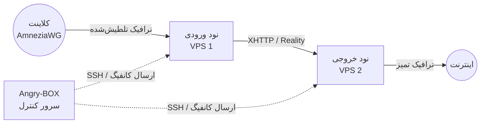

**Languages:** [English](README.md) | [Russian](README.ru.md) | [Chinese](README.zh.md) | [Farsi](README.fa.md)

# Angry-BOX

**کاملاً خودنوشته — SSH-only orchestrator / control plane**

Angry-BOX یک محصول کاملاً اورجینال است که از صفر نوشته شده. این پروژه fork از 3x-ui، LucX-UI، x-ui یا هیچ پنل دیگری نیست.

مدیریت فقط از طریق SSH انجام می‌شود. روی نودها فقط هستهٔ **sing-box-extended** (و در صورت نیاز xray) به همراه کانفیگ حداقلی اجرا می‌شود — بدون هیچ agent.

## نمای کلی

**Angry-BOX** یک ارکستراتور (control plane) کاملاً اورجینال و خودنوشته برای ساخت و مدیریت زیرساخت پروکسی پیچیدهٔ ضد-DPI است.

این پروژه هسته‌های **sing-box-extended** را از طریق SSH بدون agent روی نودها هدایت می‌کند. تمام منطق — ترکیب زنجیره، تولید کانفیگ مبتنی‌برنقش، بازگشت، رابط کاربری و استقرار — از صفر نوشته شده است.

## امکانات

- **بازپس‌گیری سرور VPN موجود (takeover):** اتصال به نودی که VPN فعلی (AWG / awg-quick، sing-box، Xray/3x-ui، MTProxy/telemt) روی آن اجرا می‌شود → Angry-BOX آن را تشخیص می‌دهد، هشدار می‌دهد و — با تأیید شما — sing-box را نصب می‌کند، **کانفیگ موجود را با همان تنظیمات به sing-box تبدیل می‌کند**، VPN قدیمی را غیرفعال (اما نه حذف) می‌کند، sing-box را راه‌اندازی می‌کند و اگر sing-box بالا نیاید **به‌طور خودکار به VPN قدیمی بازمی‌گردد**.
- **ضبط امضای زنده QUIC:** اثر انگشت QUIC-silhouette واقعی دامنه (UDP→QUIC Initial با SNI=domain→ضبط پاسخ‌های سرور) و استفاده از آن به‌عنوان AmneziaWG CPS I1-I5، تا DPI ترافیکی غیرقابل‌تشخیص از QUIC واقعی به آن دامنه ببیند.
- **ارکستراسیون خودکار:** نیازی به نوشتن دستی کانفیگ‌های پیچیده JSON برای `sing-box` نیست. Angry-BOX در چند ثانیه کانفیگ‌ها را از طریق SSH تولید، اعتبارسنجی و مستقر می‌کند.
- **تلطیش پیشرفته:** VLESS REALITY+XHTTP با حداکثر تلطیش (REALITY بدون ECH، padding با tokenish، قرار دادن cookie، xmux، پشتیبانی از منحنی پس-کوانتومی سمت کلاینت)، AmneziaWG (هسته + userspace)، TUIC، Hysteria2، MTProxy FakeTLS — با ۴ سطح تلطیش (max/high/standard/minimal) و ۴۵ preset مسیریابی (Telegram/YouTube/Netflix/…).
- **زنجیره‌های چندهاپی (multi-hop):** ساخت زنجیره‌های ۲ یا ۳ نودی؛ AmneziaWG هم به‌عنوان نقطه ورود کلاینت (هسته awg-quick + bind_interface) و هم به‌عنوان hop بین‌نودی (userspace wireguard endpoint با amnezia — باینری پچ‌شده panic بالادستی `chacha20poly1305` را که قبلاً AWG حالت هسته را خراب می‌کرد، برطرف می‌کند).
- **Failover و بارگذاری متعادل:** `urltest`، `failover`، `selector` و `fallback` با round-robin پچ‌شده برای هر اتصال.
- **استقرار قابل اعتماد با بازگشت (rollback):** هر اعمال backup انجام می‌دهد (cp، حفظ می‌شود) → cert → upload → `sing-box check` (stderr نمایش داده می‌شود) → restart → health-probe واقعی → بازگشت هنگام شکست؛ قفل per-node از رقابت deploy همزمان جلوگیری می‌کند.
- **رابط کاربری وب مدرن:** ویرایشگر توپولوژی spider-web (لبه‌های گراف، موقعیت‌های پایدار نود، pan/zoom بومی SVG)، وضعیت deploy (نشانگر pending-changes)، گزارش ممیزی، پروفایل‌ها/سرویس‌ها، کلاینت‌های یکپارچه، قوانین مسیریابی — بر پایه HTMX + TailwindCSS + DaisyUI + templ.
- **auto-apply پس‌زمینه:** تغییرات کاربر/inbound یک deploy SSH پس‌زمینه را راه می‌اندازد (حالت ترکیبی)؛ قفل per-host آنها را سریال می‌کند.
- **۱۰۰٪ مستقل:** Angry-BOX باینری **sing-box-extended پچ‌شده** خود را (deps/) عرضه می‌کند، بنابراین VPSهای ضعیف هرگز Go را کامپایل نمی‌کنند — فقط دانلود می‌کنند.
- **Zero-Footprint:** سرورهای نود فقط هسته `sing-box` را اجرا می‌کنند؛ ارکستراتور کاملأ روی ماشین کنترل شما قرار دارد.

## اسکرین‌شات‌ها

<div align="center">
  
  <br>
  <em>داشبورد رابط کاربری وب Angry-BOX (v0.1.0)</em>
</div>

> اسکرین‌شات‌ها بازنویسی v0.1.0 را نشان می‌دهند (تولید کانفیگ مبتنی‌برنقش، takeover، ویرایشگر گراف spider-web، وضعیت deploy، ممیزی).

## معماری

برخلاف پنل‌های سنتی که به عامل‌های سنگین روی هر سرور نیاز دارند، Angry-BOX از **رویکرد بدون‌عامل و بدون‌حالت** استفاده می‌کند:



## شروع به کار

### ۱. نصب

آخرین نسخه را از صفحه [Releases](https://github.com/AlexeyLCP/angry-box/releases) دانلود کنید یا اسکریپت نصب را اجرا کنید:

```bash
curl -fsSL https://raw.githubusercontent.com/AlexeyLCP/angry-box/main/scripts/install.sh | sh
```

### ۲. راه‌اندازی رابط کاربری وب

```bash
angry-box serve -listen 0.0.0.0:8090
```

*توجه: در اولین اجرا یک رمز عبور امن تصادفی برای رابط کاربری وب تولید می‌شود.*

### ۳. شروع سریع CLI

```bash
# 1. نودهای VPS خود را اضافه کنید
angry-box host add entry-node --addr 1.2.3.4:22 --user root --key ~/.ssh/id_ed25519
angry-box host add exit-node --addr 5.6.7.8:22 --user root --key ~/.ssh/id_ed25519

# 2. باینری sing-box-extended پچ‌شده را روی نودها مستقر کنید
#    (-sudo برای کاربران SSH غیر root با sudo بدون رمز؛ -install-awg همچنین ماژول هسته AmneziaWG را نصب می‌کند)
angry-box deploy -addr 1.2.3.4 -key ~/.ssh/id_ed25519 -sudo
angry-box deploy -addr 5.6.7.8 -key ~/.ssh/id_ed25519 -sudo

# 3. یک زنجیره بسازید
angry-box chain create my-chain --nodes entry-node,exit-node --user-protocol awg --transport xhttp

# 4. زنجیره را اعمال کنید (تولید + ارسال کانفیگ به همه نودها، با rollback هنگام شکست)
angry-box apply-chain my-chain

# 5. یک کانفیگ مستقل را به‌صورت محلی (مثلاً REALITY+XHTTP) بدون ارسال تولید کنید
angry-box config -port 443
```

**بازپس‌گیری** (تشخیص + تبدیل سرور VPN موجود) از رابط کاربری وب در دسترس است: نود را باز کنید → دکمه **بازپس‌گیری**. این AWG/sing-box/Xray/MTProxy را تشخیص می‌دهد، کانفیگ را به sing-box با همان تنظیمات تبدیل می‌کند، VPN قدیمی را غیرفعال می‌کند و اگر sing-box شکست بخورد خودکار بازمی‌گردد.

## اجزای شخص ثالث

- **[sing-box](https://github.com/SagerNet/sing-box)** و **[sing-box-extended](https://github.com/shtorm-7/sing-box-extended)** (GPLv3)
- **[AmneziaWG Linux Kernel Module](https://github.com/amnezia-vpn/amneziawg-linux-kernel-module)** (GPLv2)
- **[awg-multi-script از pumbaX](https://github.com/pumbaX/awg-multi-script)** (MIT) — شیوه‌های برتر تلطیش AmneziaWG (نادرست‌های Jc/Jmin/Jmax/S1-S4/H1-H4، تولید بسته CPS)
- **[awg-manager از hoaxisr](https://github.com/hoaxisr/awg-manager)** (MIT) — الگوریتم ضبط امضای زنده QUIC (منطق «بازپس‌گیری VPN موجود»: اتصال به domain:443 از طریق UDP، ارسال QUIC Initial، ضبط بسته‌های پاسخ سرور به‌عنوان I1-I5)
- **[templ](https://github.com/a-h/templ)** (MIT) — قالب‌های HTML برای رابط کاربری وب
- **[golang.org/x/crypto/ssh](https://go.googlesource.com/crypto)** (BSD-3-Clause) — کلاینت Go SSH
- **HTMX، TailwindCSS و DaisyUI** (MIT / BSD)

## قدردانی

- تشکر ویژه از **Aleksandr SacredX** برای آزمایش گسترده و ایده‌های ارزشمند.
- ضبط امضای زنده QUIC (که Angry-BOX برای اثر انگشت QUIC-silhouette دامنه واقعی تحت AmneziaWG CPS I1-I5 استفاده می‌کند) از **[hoaxisr/awg-manager](https://github.com/hoaxisr/awg-manager)** پورت شده است.
- تولید پارامترهای تلطیش AmneziaWG (پروفایل‌ها + ناوراری‌ها) و ژنراتورهای سنتزشده بسته CPS (شکل‌های TLS/DNS/SIP/QUIC ClientHello برای I1-I5) از **[pumbaX/awg-multi-script](https://github.com/pumbaX/awg-multi-script)** پورت شده‌اند.
- انتقال XHTTP + فیلدهای تلطیش پیشرفته از **تیم Xray (RPRX)**؛ تولید هدر HTTP واقع‌گرایانه با الهام از **[NaiveProxy](https://github.com/SagerNet/naive)**.
- **Hysteria2**، **NaiveProxy**، **Telemt**، و بسیاری از پژوهشگران ضد-سانسور روسی، ایرانی و چینی.

## ساخت از کد منبع

```bash
git clone https://github.com/AlexeyLCP/angry-box.git
cd angry-box

# ساخت production (همه چیز جاسازی شده)
go build -o angry-box ./cmd/angry-box

# حالت توسعه (فایل‌های استاتیک از دیسک، ویرایش بدون بازساخت)
ANGRY_BOX_DEV=1 go run ./cmd/angry-box serve
```

## پروانه

**PolyForm Noncommercial License 1.0.0**

برای مصارف شخصی، آموزشی و پژوهشی رایگان است. استفاده تجاری نیازمند اجازه کتبی است.

متن کامل را در [LICENSE](LICENSE) ببینید.