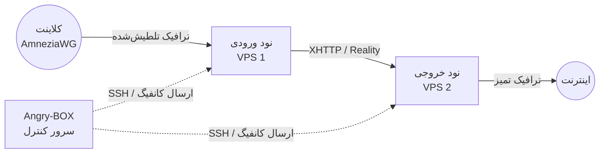

<div align="center">

# Angry-BOX

**کاملاً خودنوشته — SSH-only orchestrator / control plane**

Angry-BOX یک محصول کاملاً اورجینال است که از صفر نوشته شده. این پروژه fork از 3x-ui، LucX-UI، x-ui یا هیچ پنل دیگری نیست.

مدیریت فقط از طریق SSH انجام می‌شود. روی نودها فقط هستهٔ **amnezia-box** (فورک ما از sing-box 1.14) به همراه کانفیگ حداقلی اجرا می‌شود — بدون هیچ agent.

🌐 **Languages / Языки:** [English](README.md) | [Русский](README.ru.md) | [简体中文](README.zh.md) | [فارسی](README.fa.md)

<p align="center">
  <a href="https://github.com/AlexeyLCP/angry-box/releases"></a>
  <a href="https://golang.org"></a>
  <a href="LICENSE"></a>
  <a href="https://yoomoney.ru/to/41001989176429"></a>
</p>

</div>

## نمای کلی

**Angry-BOX** یک ارکستراتور (control plane) کاملاً اورجینال و خودنوشته برای ساخت و مدیریت زیرساخت پروکسی پیچیدهٔ ضد-DPI است.

این پروژه هسته‌های **amnezia-box** (فورک ما از sing-box 1.14) را از طریق SSH بدون agent روی نودها هدایت می‌کند. تمام منطق — ترکیب زنجیره، تولید کانفیگ ادغام‌شده، تولید مبتنی بر نقش، ردیابی سلامت نود، بازگشت (rollback)، رابط کاربری و استقرار — از صفر نوشته شده است.

## امکانات

- **بازپس‌گیری سرور VPN موجود (takeover):** اتصال به نودی که VPN فعلی (AWG / awg-quick، sing-box، Xray/3x-ui، MTProxy/telemt) روی آن اجرا می‌شود → Angry-BOX آن را تشخیص می‌دهد، هشدار می‌دهد و — با تأیید شما — sing-box را نصب می‌کند، **کانفیگ موجود را با همان تنظیمات به sing-box تبدیل می‌کند**، VPN قدیمی را غیرفعال (اما نه حذف) می‌کند، sing-box را راه‌اندازی می‌کند و اگر sing-box بالا نیاید **به‌طور خودکار به VPN قدیمی بازمی‌گردد**.
- **ضبط امضای زنده QUIC:** اثر انگشت QUIC-silhouette واقعی دامنه (UDP→QUIC Initial با SNI=domain→ضبط پاسخ‌های سرور) و استفاده از آن به‌عنوان AmneziaWG CPS I1-I5، تا DPI ترافیکی غیرقابل‌تشخیص از QUIC واقعی به آن دامنه ببیند.
- **وارد کردن کانفیگ‌های موجود AmneziaWG:** دریافت رابط AWG + لیست peer سرور در حال اجرا از طریق SSH و بازپر کردن آن به‌عنوان inboundهای نود به‌صورت **غیرتخریبی** (فقط placeholder — هرگز کلیدها/پورت‌ها/presetهای تنظیم‌شده توسط اپراتور را بازنویسی نمی‌کند). امکان پذیرش یک باکس AWG بدون نیاز به تایپ مجدد.
- **ارکستراسیون خودکار:** نیازی به نوشتن دستی کانفیگ‌های پیچیده JSON برای `sing-box` نیست. Angry-BOX در چند ثانیه کانفیگ‌ها را از طریق SSH تولید، اعتبارسنجی و مستقر می‌کند.
- **تلطیش پیشرفته (تمرکز محصول v0.2.x):** AmneziaWG (هسته + متعادل‌کننده)، VLESS REALITY+XHTTP با حداکثر تلطیش، MTProxy/Telemt FakeTLS — با ۴ سطح تلطیش (max/high/standard/minimal) و ۴۵ preset مسیریابی (Telegram/YouTube/Netflix/…). TUIC و Hysteria2 متوقف شده‌اند (موکول شدن کار رویکرد TLS/QUIC).
- **زنجیره‌های چندهاپی (multi-hop):** ساخت زنجیره‌های ۲ یا ۳ نودی؛ AmneziaWG هم به‌عنوان نقطه ورود کلاینت (هسته awg-quick + bind_interface) و هم به‌عنوان hop بین‌نودی (userspace wireguard endpoint با amnezia).
- **Inboundهای درجه یک (v0.8):** پروفایل‌های inbound (AWG / VLESS+REALITY / MTProxy) یک بار ساخته شده و روی هر مجموعه‌ای از نودها مستقر می‌شوند — ویرایش پروفایل فقط نودهای متأثر را مجدداً مستقر می‌کند.
- **سطوح زنجیره با استراتژی‌های متعادل‌سازی (v0.8):** زنجیره لیستی مرتب از گروه‌های نود است — `ورودی → [Hop-1, Hop-2] → [خروجی-1, خروجی-2]` — با استراتژی در هر سطح: Round-robin (fallback)، urltest، failover، selector.
- **کلاینت‌های ساده‌شده (v0.8):** افزودن کلاینت = انتخاب نام و زنجیره‌های قابل استفاده؛ کلیدها و UUIDها به‌طور خودکار مشتق می‌شوند. همراه با لینک اشتراک (Subscription URL)، کانفیگ‌ها و کد QR.
- **Failover و بارگذاری متعادل:** `urltest`، `failover`، `selector` و `fallback` با round-robin پچ‌شده.
- **استقرار قابل اعتماد با بازگشت (rollback):** هر اعمال backup انجام می‌دهد → cert → upload → `sing-box check` → restart → health-probe واقعی → بازگشت هنگام شکست.
- **پشتیبان‌گیری + انتقال سریع نود (Relocate):** خروجی گرفتن از کل پنل یا هویت یک نود به صورت JSON؛ هنگام مسدود شدن IP نود، **Relocate** آن را به VPS جدید منتقل می‌کند — کلیدهای ترانزیت حفظ می‌شوند، بنابراین کلاینت‌ها نیاز به پیکربندی مجدد ندارند. **Clone** نود برای ایجاد نسخه همانند با هویت جدید.
- **پشتیبان‌گیری رمزنگاری‌شده خارج از سایت:** ارسال نسخه رمزنگاری‌شده پنل با رمز عبور به سرور از راه دور از طریق SSH (scrypt KDF + AES-256-GCM).
- **ماشین وضعیت سلامت نود:** ردیابی وضعیت نود `healthy → suspect → down → unreachable` و وضعیت **blocked**.
- **جادوگر کاربران و مدل سرویس:** افزودن کاربر از طریق جادوگر، مشاهده **Service** و دریافت **لینک اشتراک**.
- **رابط کاربری وب مدرن:** ویرایشگر توپولوژی spider-web، وضعیت استقرار، گزارش ممیزی، پروفایل‌ها/سرویس‌ها، قوانین مسیریابی — بر پایه HTMX + TailwindCSS + DaisyUI + templ.
- **auto-apply پس‌زمینه:** تغییرات کاربر/inbound استقرار SSH پس‌زمینه را راه می‌اندازد.
- **انتقال خودکار (استخر گرم):** هنگام انتقال نود به down/unreachable، ارکستراتور می‌تواند آن را به VPS رزرو منتقل کند.
- **مدیریت کاربران بدون قطعی:** اعمال تغییرات لیست peerها به‌صورت زنده از طریق **`awg set`** — بدون ریستارت `awg-quick`.
- **عیب‌یابی AWG:** ابزار **Diagnose** برای بررسی عمیق data-plane از طریق SSH.
- **محاسبه ترافیک هر کاربر:** شمارنده‌های هسته به بایت‌های تجمعی کاربر تبدیل می‌شوند.
- **خودترمیمی NAT:** بازیابی خودکار قوانین FORWARD/MASQUERADE هنگام پاک شدن iptables.
- **پک‌های روتر (Keenetic + OpenWrt):** پکیج‌های `.ipk` آماده برای Keenetic Entware و OpenWrt.
- **۱۰۰٪ مستقل:** Angry-BOX باینری اختصاصی **amnezia-box** خود را عرضه می‌کند — بدون نیاز به کامپایل Go روی VPS.
- **Zero-Footprint:** نودها فقط هسته `sing-box` را اجرا می‌کنند؛ ارکستراتور کاملاً روی ماشین کنترل قرار دارد.

## اسکرین‌شات‌ها

<div align="center">
  
  <br>
  <em>داشبورد رابط کاربری وب Angry-BOX</em>
  <br><br>
  
  <br>
  <em>ویرایشگر توپولوژی spider-web — گراف زنجیره چندهاپی</em>
  <br><br>
  
  <br>
  <em>کاربران — پروتکل‌ها، دسترسی به زنجیره‌ها و وضعیت چرخه حیات</em>
</div>

> اسکرین‌شات‌ها امکانات نسخه جاری را نشان می‌دهند (ماشین وضعیت سلامت نود، جادوگر کاربران، کلون/انتقال/انتقال خودکار، پشتیبان‌گیری رمزنگاری‌شده، عیب‌یابی AWG، ویرایشگر گراف spider-web، وضعیت استقرار، takeover، ممیزی).

## معماری

برخلاف پنل‌های سنتی که به عامل‌های سنگین روی هر سرور نیاز دارند، Angry-BOX از **رویکرد بدون‌عامل و بدون‌حالت** استفاده می‌کند:



## شروع به کار

### ۱. نصب

آخرین نسخه را از صفحه [Releases](https://github.com/AlexeyLCP/angry-box/releases) دانلود کنید یا اسکریپت نصب را اجرا کنید:

```bash
curl -fsSL https://raw.githubusercontent.com/AlexeyLCP/angry-box/main/scripts/install.sh | sh
```

### ۲. راه‌اندازی رابط کاربری وب

```bash
angry-box serve -listen 0.0.0.0:8090
```

*نکته: در اولین اجرا، یک رمز عبور امن و تصادفی برای رابط وب تولید می‌شود.*

### ۳. شروع سریع CLI

```bash
# ۱. افزودن نودهای VPS
angry-box host add entry-node --addr 1.2.3.4:22 --user root --key ~/.ssh/id_ed25519
angry-box host add exit-node --addr 5.6.7.8:22 --user root --key ~/.ssh/id_ed25519

# ۲. استقرار باینری amnezia-box روی نودها
#    (-sudo برای کاربران غیر root؛ -install-awg ماژول هسته AmneziaWG را نصب می‌کند)
angry-box deploy -addr 1.2.3.4 -key ~/.ssh/id_ed25519 -sudo
angry-box deploy -addr 5.6.7.8 -key ~/.ssh/id_ed25519 -sudo

# ۳. ایجاد زنجیره
angry-box chain create my-chain --nodes entry-node,exit-node --user-protocol awg --transport xhttp

# ۴. اعمال زنجیره (تولید و ارسال کانفیگ به تمام نودها با قابلیت بازگشت)
angry-box apply-chain my-chain

# ۵. تولید کانفیگ مستقل به‌صورت محلی (مانند REALITY+XHTTP) بدون ارسال
angry-box config -port 443

# ۶. پشتیبان‌گیری از پنل + انتقال نود مسدودشده به VPS جدید
angry-box backup store -o panel-backup.json          # پشتیبان‌گیری از کل پنل
angry-box backup node entry-node -o entry-node.json  # هویت قابل حمل یک نود
angry-box restore panel-backup.json                 # تشخیص خودکار و بازیابی
# هنگام مسدود شدن IP نود، آن را به VPS جدید منتقل کنید — کلیدها حفظ می‌شوند
# و سایر نودها و کلاینت‌ها نیازی به پیکربندی مجدد ندارند:
angry-box relocate entry-node --addr 9.9.9.9:22
```

### ۴. روی روتر (Keenetic / OpenWrt)

```bash
# Keenetic (Entware) — پکیج مناسب مدل خود را از Releases انتخاب کنید:
opkg install angry-box_v0.7.0_mipsel-3.4-kn.ipk      # MT7621 و مشابه
# OpenWrt:
opkg install angry-box_v0.7.0_aarch64_cortex-a53.ipk
# پنل روی 127.0.0.1:9080 اجرا می‌شود — دسترسی از طریق تونل SSH.
```

**بازپس‌گیری (Takeover)** از طریق Web UI در دسترس است: باز کردن نود ← دکمه **Takeover**. **پشتیبان‌گیری و انتقال نود** نیز در Web UI موجود است: Settings ← Backups و سطر نود ← **Export** / **Relocate**.

## قطعات شخص ثالث

- **[sing-box](https://github.com/SagerNet/sing-box)** و **[amnezia-box](https://github.com/AlexeyLCP/amnezia-box)** (فورک ما از sing-box 1.14، GPLv3)
- **[AmneziaWG Linux Kernel Module](https://github.com/amnezia-vpn/amneziawg-linux-kernel-module)** (GPLv2)
- **[awg-multi-script by pumbaX](https://github.com/pumbaX/awg-multi-script)** (MIT) — بهترین روش‌های تلطیش AmneziaWG
- **[awg-manager by hoaxisr](https://github.com/hoaxisr/awg-manager)** (MIT) — الگوریتم ضبط امضای زنده QUIC
- **[templ](https://github.com/a-h/templ)** (MIT) — قالب‌های HTML برای Web UI
- **[golang.org/x/crypto/ssh](https://go.googlesource.com/crypto)** (BSD-3-Clause) — کلاینت Go SSH
- **HTMX, TailwindCSS, و DaisyUI** (MIT / BSD)

## قدردانی

- تشکر ویژه از **Aleksandr SacredX** برای تست‌های گسترده و ایده‌های ارزشمند.
- ضبط امضای زنده QUIC پورت‌شده از **[hoaxisr/awg-manager](https://github.com/hoaxisr/awg-manager)**.
- پارامترهای تلطیش AmneziaWG پورت‌شده از **[pumbaX/awg-multi-script](https://github.com/pumbaX/awg-multi-script)**.
- انتقال XHTTP از **تیم Xray (RPRX)**؛ تولید هدرهای HTTP از **[NaiveProxy](https://github.com/SagerNet/naive)**؛ تکه‌تکه‌سازی از **Hysteria2 Gecko**.
- **Hysteria2**, **NaiveProxy**, **Telemt**, و تمام پژوهشگران ضد سانسور.

## ساخت از سورس

```bash
git clone https://github.com/AlexeyLCP/angry-box.git
cd angry-box

# ساخت نسخه تولید (همه چیز درون‌سازی‌شده)
go build -o angry-box ./cmd/angry-box

# حالت توسعه
ANGRY_BOX_DEV=1 go run ./cmd/angry-box serve
```

## ☕ حمایت از پروژه

Angry-BOX برای استفاده شخصی و غیرتجاری رایگان است. اگر این ارکستراتور زمان شما را صرفه‌جویی می‌کند، می‌توانید از توسعه آن حمایت کنید:

| روش | جزئیات |
|---|---|
| 🇷🇺 **YooMoney** (روبل، روسیه) | [yoomoney.ru/to/41001989176429](https://yoomoney.ru/to/41001989176429) |
| 💎 **USDT (TON)** | `UQC48dE4i35bjEU4jljx0h1CGeXMu77eKZwN5W4gbcibmqDs` |
| 💠 **USDT (ERC-20)** | `0xA49aBc042c5BB3d682788D3DEB2eAC833343a873` |

اهدا فقط تشکر است و به منزله خرید مجوز تجاری نیست.

## مجوز

**PolyForm Noncommercial License 1.0.0**

رایگان برای اهداف شخصی، آموزشی و پژوهشی. استفاده تجاری نیازمند مجوز کتبی است.

متن کامل در [LICENSE](LICENSE).