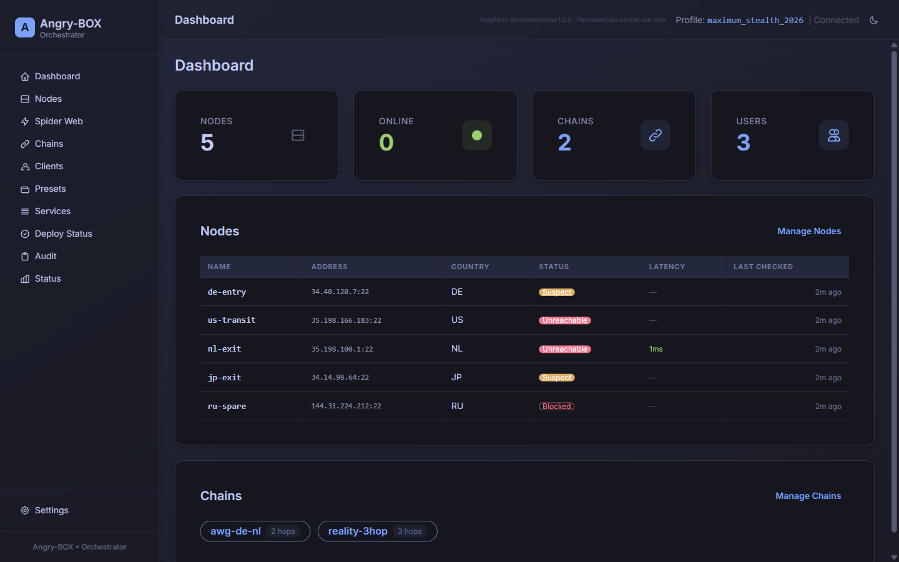
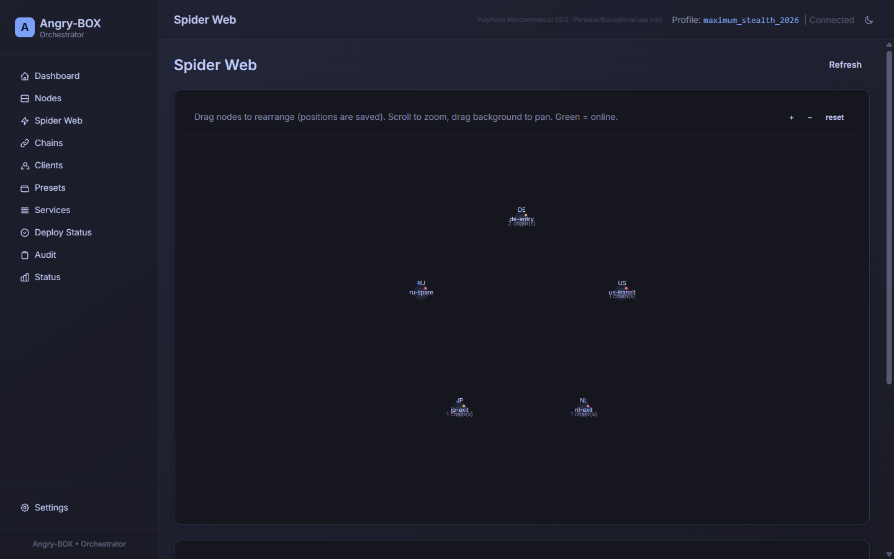
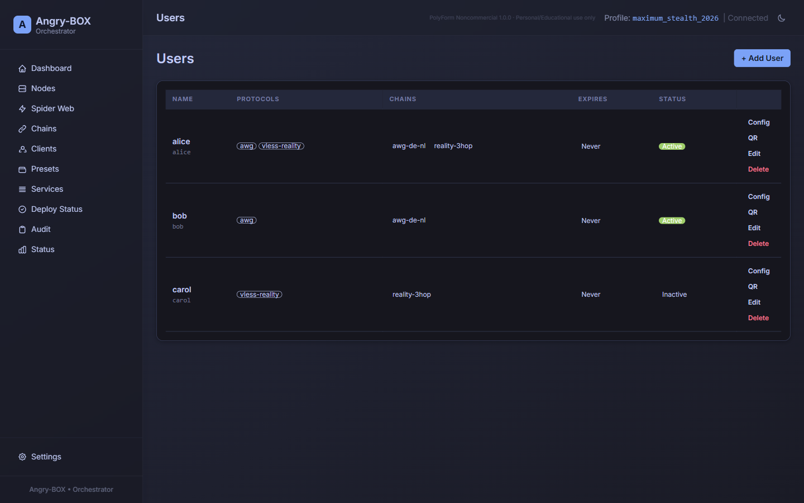
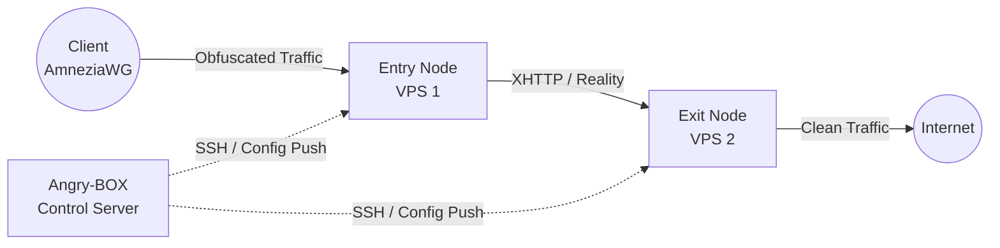

**Languages:** [English](README.md) | [Russian](README.ru.md) | [Chinese](README.zh.md) | [Farsi](README.fa.md)

# Angry-BOX

**Fully self-written SSH-only orchestrator / control plane.**

Angry-BOX is an original product written from scratch. It is **not** a fork of 3x-ui, LucX-UI, x-ui, or any other panel.

Management is done exclusively over SSH. Target nodes run **only** amnezia-box (our sing-box 1.14 fork) with a minimal config — no agents.

<p>
  <a href="https://github.com/AlexeyLCP/angry-box/releases"></a>
  <a href="https://golang.org"></a>
  <a href="LICENSE"></a>
  <a href="https://yoomoney.ru/to/41001989176429"></a>
</p>


## Overview

**Angry-BOX** is a fully original, self-written orchestrator (control plane) for building and managing complex anti-DPI proxy infrastructure.

It drives **amnezia-box** (our sing-box 1.14 fork) cores over SSH with zero agents on the nodes. The entire logic — chain composition, merged configs, per-user material, node health tracking, rollback, UI, and deployment — was written from scratch.

## Features

- **Takeover an existing VPN server:** connect to a node running an existing VPN (AWG / awg-quick, sing-box, Xray/3x-ui, MTProxy/telemt), Angry-BOX detects it, warns you, and — on consent — installs sing-box, **converts the existing config to sing-box with the same settings**, disables (but does not delete) the old VPN, starts sing-box, and **auto-rolls back to the old VPN** if sing-box fails to come up.
- **Live QUIC signature capture:** fingerprint a real domain's QUIC silhouette (UDP→QUIC Initial with SNI=domain→capture server responses) and use it as AmneziaWG CPS I1-I5, so DPI sees traffic indistinguishable from real QUIC to that domain.
- **Import existing AmneziaWG configs:** pull the running server's AWG interface + peer list over SSH and back-fill it as a node's inbounds **non-destructively** (placeholder-only — never overwrites operator-set keys, ports, or presets). Lets you adopt an AWG box without re-typing anything.
- **Automated Orchestration:** no need to manually write complex `sing-box` JSON configs. Angry-BOX generates, validates, and deploys configs over SSH in seconds.
- **Advanced Obfuscation (product focus v0.2.x):** AmneziaWG (kernel + balancer), VLESS REALITY+XHTTP max obfuscation, MTProxy/Telemt FakeTLS — with 4 obfuscation levels (max/high/standard/minimal) and 45 routing presets (Telegram/YouTube/Netflix/…). TUIC and Hysteria2 are **paused** (QUIC/TLS cert work deferred).
- **Multi-Hop Chains:** construct 2-node or 3-node proxy chains; AmneziaWG works both as a client entry point (kernel awg-quick + sing-box bind_interface) and as an inter-node hop (userspace wireguard endpoint with amnezia — the patched binary fixes the upstream `chacha20poly1305` panic that previously crashed kernel-mode AWG).
- **First-class Inbounds (v0.8):** inbound profiles (AWG / VLESS+REALITY / MTProxy) are created once and deployed onto any set of nodes with per-node credentials — edit the profile and only the affected nodes re-deploy. Chains reference deployed inbounds instead of owning listeners.
- **Chain levels with balancing strategies (v0.8):** a chain is an ordered list of node-group levels — `Entry → [Hop-1, Hop-2] → [Exit-1, Exit-2, Exit-3]` — with per-level strategies: Round-robin (fallback, default — patched per-connection balancing), urltest, failover, selector.
- **Simplified Clients (v0.8):** add a client = pick a name and the chains they can use; AWG peers and VLESS UUIDs are derived automatically. Subscription URL, per-chain configs and QR codes included.
- **Failover & Load Balancing:** `urltest`, `failover`, `selector`, and a patched per-connection round-robin `fallback`.
- **Reliable deploy with rollback:** every apply does backup (cp, preserved) → cert → upload → `sing-box check` (stderr surfaced) → restart → real health-probe → rollback on failure; per-node lock prevents concurrent-deploy races.
- **Backups + quick node relocation:** export the whole panel (or one node's portable identity) as a JSON backup and restore/migrate it; when a node's IP gets blocked, **Relocate** moves it to a fresh VPS — keeping the node's transit keys so other nodes and existing clients are NOT reconfigured — and re-deploys every chain containing it so the new IP propagates to dependent hops automatically (UI button + `angry-box relocate` CLI). **Clone** a node to spin up a replica with a fresh identity (regenerated keys/ports + a freshly-allocated AWG /24 subnet, copying its ForUsers + ExitTargets).
- **Encrypted offsite backups:** push an encrypted, passphrase-protected copy of the whole panel to a remote host over SSH on a schedule and on-demand (scrypt KDF + AES-256-GCM; tunable scrypt N; retention by N blobs with server-side `ls`/`rm` rotation). The master key never leaves your control machine — the offsite passphrase is separate.
- **Node health state machine:** each node is probed and tracked through `healthy → suspect → down → unreachable` with hysteresis (down after N consecutive fails, recover after M consecutive OKs), plus an operator-marked **blocked** state (sticky until cleared). State transitions are audited and surfaced in the UI (status badge on every node + per-state counts on the dashboard).
- **Users wizard + Service model:** add a user through a guided wizard (select chains → pick protocols → assign AWG per-user address), inspect the synthesized **Service** (the merged view of a user across all chains), and get a ready-to-share **subscription URL** that hands the client the right config per chain.
- **Modern Web UI:** Spider-web topology editor (graph edges, persistent node positions, native SVG pan/zoom), deploy-status (pending-changes badge), audit log, profiles/services, unified clients, route rules — built with HTMX + TailwindCSS + DaisyUI + templ.
- **Background auto-apply:** per-user/inbound mutations trigger a background SSH deploy (hybrid mode); per-host lock serializes.
- **Auto-relocate (warm pool):** when the health monitor moves a node to down/unreachable, the orchestrator can automatically relocate it onto a **spare VPS** — opt-in per node AND globally, with a cooldown and every decision audited. The node keeps its identity (keys/ports), so existing clients never notice.
- **Zero-downtime user management:** deploys that only change the peer set (user add/remove) apply **live via `awg set`** — no `awg-quick` restart, no dropped clients. Interface changes still restart (they must).
- **AWG diagnostics:** one click on the node row (**Diagnose**) deep-probes the data plane over SSH — interface state, handshake freshness, ip_forward, rp_filter, FORWARD rules into the TUN overlay, sing-box health — each check with the evidence read on the node.
- **Per-user traffic accounting:** kernel per-peer counters (`awg show transfer`) are folded into cumulative per-user bytes (peer = user AWG identity), restart-safe, shown in the users table.
- **Self-healing NAT:** the health loop re-asserts FORWARD/MASQUERADE rules when fail2ban or Docker flushes iptables (a silent egress killer) — healed automatically, audited.
- **Router packages (Keenetic + OpenWrt):** ready-made `.ipk` for Keenetic Entware (mipsel/mips/aarch64, with NDMS interface hooks) and OpenWrt (procd) — stripped + UPX-compressed (~3 MB), smoke-tested under qemu in CI. Deploy downloads also tolerate mirrors (`ANGRY_BINARY_MIRRORS`) when GitHub is unreachable from a node's network.
- **100% Independent:** Angry-BOX ships its own **amnezia-box** sing-box binary (our sing-box 1.14 fork) (deps/), so weak VPSes never compile Go — they just download.
- **Zero-Footprint:** node servers run only the bare `sing-box` core; the orchestrator lives entirely on your control machine.

## Screenshots

<div align="center">
  
  <br>
  <em>The Angry-BOX Web UI Dashboard</em>
  <br><br>
  
  <br>
  <em>Spider-web topology editor — multi-hop chain graph</em>
  <br><br>
  
  <br>
  <em>Users — per-user protocols, chain access, lifecycle status</em>
</div>

> Screenshots reflect the current build (node health state machine, users wizard + per-user traffic, clone/relocate/auto-relocate, encrypted offsite backups, AWG diagnostics, spider-web graph editor, deploy-status, takeover, audit).

## Architecture

Unlike traditional panels that require heavy agents on every server, Angry-BOX takes a **stateless agentless approach**:



## Getting Started

### 1. Installation

Download the latest release for your platform from the [Releases](https://github.com/AlexeyLCP/angry-box/releases) page, or run the install script:

```bash
curl -fsSL https://raw.githubusercontent.com/AlexeyLCP/angry-box/main/scripts/install.sh | sh
```

### 2. Starting the Web UI

```bash
angry-box serve -listen 0.0.0.0:8090
```

*Note: On first run, a random secure password is generated for the Web UI.*

### 3. CLI Quick Start

```bash
# 1. Add your VPS nodes
angry-box host add entry-node --addr 1.2.3.4:22 --user root --key ~/.ssh/id_ed25519
angry-box host add exit-node --addr 5.6.7.8:22 --user root --key ~/.ssh/id_ed25519

# 2. Deploy the amnezia-box sing-box binary to the nodes
#    (-sudo for non-root SSH users with passwordless sudo; -install-awg also installs the AmneziaWG kernel module)
angry-box deploy -addr 1.2.3.4 -key ~/.ssh/id_ed25519 -sudo
angry-box deploy -addr 5.6.7.8 -key ~/.ssh/id_ed25519 -sudo

# 3. Create a chain
angry-box chain create my-chain --nodes entry-node,exit-node --user-protocol awg --transport xhttp

# 4. Apply the chain (generates + pushes configs to all nodes, with rollback on failure)
angry-box apply-chain my-chain

# 5. Generate a standalone config locally (e.g. REALITY+XHTTP) without pushing
angry-box config -port 443

# 6. Back up the panel + relocate a blocked node to a fresh VPS
angry-box backup store -o panel-backup.json          # whole-panel backup
angry-box backup node entry-node -o entry-node.json  # one node's portable identity
angry-box restore panel-backup.json                 # auto-detects store vs node, restores
# When entry-node's IP gets blackholed, move it to a new VPS — transit keys are
# reused, so other nodes + existing clients are NOT reconfigured; every chain
# containing the node is re-deployed so the new IP propagates:
angry-box relocate entry-node --addr 9.9.9.9:22
```

### 4. On a router (Keenetic / OpenWrt)

```bash
# Keenetic (Entware) — pick the package for your model from Releases:
opkg install angry-box_v0.7.0_mipsel-3.4-kn.ipk      # MT7621 & co
# OpenWrt:
opkg install angry-box_v0.7.0_aarch64_cortex-a53.ipk
# Panel comes up on 127.0.0.1:9080 (loopback) — reach it via an SSH tunnel.
```

**Takeover** (detect + convert an existing VPN server) is available from the Web UI: open a node → **Takeover** button. It detects AWG/sing-box/Xray/MTProxy, converts the config to sing-box with the same settings, disables the old VPN, and auto-rolls back if sing-box fails. **Backups + relocation** are also in the Web UI: Settings → Backups (export/import the panel), node row → **Export** (download one node's identity) + **Relocate** (move a blocked node to a new VPS).

## Third-Party Components

- **[sing-box](https://github.com/SagerNet/sing-box)** and **[amnezia-box](https://github.com/AlexeyLCP/amnezia-box)** (our sing-box 1.14 fork, GPLv3)
- **[AmneziaWG Linux Kernel Module](https://github.com/amnezia-vpn/amneziawg-linux-kernel-module)** (GPLv2)
- **[awg-multi-script by pumbaX](https://github.com/pumbaX/awg-multi-script)** (MIT) — AmneziaWG obfuscation best practices (Jc/Jmin/Jmax/S1-S4/H1-H4 invariants, CPS packet generation)
- **[awg-manager by hoaxisr](https://github.com/hoaxisr/awg-manager)** (MIT) — live QUIC signature capture algorithm (the "Take over an existing VPN" capture logic: connect to domain:443 over UDP, send a QUIC Initial, capture server response packets as I1-I5)
- **[templ](https://github.com/a-h/templ)** (MIT) — HTML templating for the Web UI
- **[golang.org/x/crypto/ssh](https://go.googlesource.com/crypto)** (BSD-3-Clause) — Go SSH client
- **HTMX, TailwindCSS, and DaisyUI** (MIT / BSD)

## Acknowledgements

- Special thanks to **Aleksandr SacredX** for extensive testing and valuable ideas.
- The live QUIC signature capture (used by Angry-BOX to fingerprint a real domain's QUIC silhouette for AmneziaWG CPS I1-I5) is ported from **[hoaxisr/awg-manager](https://github.com/hoaxisr/awg-manager)**.
- AmneziaWG obfuscation parameter generation (profiles + invariants) and the synthesized CPS packet generators (TLS/DNS/SIP/QUIC ClientHello shapes for I1-I5) are ported from **[pumbaX/awg-multi-script](https://github.com/pumbaX/awg-multi-script)**.
- XHTTP transport + advanced obfuscation fields sourced from the **Xray team (RPRX)**; realistic HTTP header generation inspired by **[NaiveProxy](https://github.com/SagerNet/naive)**; chunk-fragmentation thinking adopted from the **Hysteria2 Gecko** design.
- **Hysteria2**, **NaiveProxy**, **Telemt**, and many Russian, Iranian, and Chinese anti-censorship researchers.

## Building from source

```bash
git clone https://github.com/AlexeyLCP/angry-box.git
cd angry-box

# Production build (everything embedded)
go build -o angry-box ./cmd/angry-box

# Dev mode (static files from disk, edits without rebuild)
ANGRY_BOX_DEV=1 go run ./cmd/angry-box serve
```

## ☕ Support the project

Angry-BOX is free for personal and non-commercial use. If the orchestrator saves you time, you can support development:

| Method | Details |
|---|---|
| 🇷🇺 **YooMoney** (RUB, Russia) | [yoomoney.ru/to/41001989176429](https://yoomoney.ru/to/41001989176429) |
| 💎 **USDT (TON)** | `UQC48dE4i35bjEU4jljx0h1CGeXMu77eKZwN5W4gbcibmqDs` |
| 💠 **USDT (ERC-20)** | `0xA49aBc042c5BB3d682788D3DEB2eAC833343a873` |

Donations are a thank-you, not a purchase: they do not grant a commercial license and do not change the license terms below.

## License

**PolyForm Noncommercial License 1.0.0**

Free for personal, educational, and research purposes. Commercial use requires written permission.

See [LICENSE](LICENSE) for full text.
