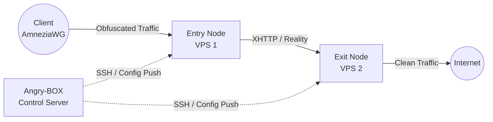

**Languages:** [English](README.md) | [Russian](README.ru.md) | [Chinese](README.zh.md) | [Farsi](README.fa.md)

# Angry-BOX

**Fully self-written SSH-only orchestrator / control plane.**

Angry-BOX is an original product written from scratch. It is **not** a fork of 3x-ui, LucX-UI, x-ui, or any other panel.

Management is done exclusively over SSH. Target nodes run **only** sing-box-extended (optionally xray) with a minimal config — no agents.

<p>
  <a href="https://github.com/AlexeyLCP/angry-box/releases"></a>
  <a href="https://golang.org"></a>
  <a href="LICENSE"></a>
</p>


## Overview

**Angry-BOX** is a fully original, self-written orchestrator (control plane) for building and managing complex anti-DPI proxy infrastructure.

It drives **sing-box-extended** cores over SSH with zero agents on the nodes. The entire logic — chain composition, merged configs, rollback, UI, and deployment — was written from scratch.

## Features

- **Automated Orchestration:** No need to manually write complex `sing-box` JSON configs. Angry-BOX generates, validates, and deploys configs over SSH in seconds.
- **Advanced Obfuscation Protocols:** Native support for `AmneziaWG`, `XHTTP`, `VLESS-Reality`, and `Hysteria2`.
- **Multi-Hop Chains:** Easily construct 2-node or 3-node proxy chains to route traffic securely through multiple jurisdictions.
- **Failover & Load Balancing:** Built-in support for `urltest`, `failover`, and `selector` strategies.
- **Modern Web UI:** Control everything from a sleek, responsive dashboard built with HTMX and TailwindCSS.
- **100% Independent:** Angry-BOX stores all critical dependencies (like `sing-box-extended` binaries and `amneziawg` kernel modules) locally.
- **Zero-Footprint:** Node servers only run the bare `sing-box` core. The orchestrator lives entirely on your control machine.

## Screenshots

<div align="center">
  
  <br>
  <em>The Angry-BOX Web UI Dashboard (v0.7.2)</em>
</div>

> Screenshots refreshed for v0.7.2 UI (dark theme, merged config support, i18n). See also Russian version for additional views.

## Architecture

Unlike traditional panels that require heavy agents on every server, Angry-BOX takes a **stateless agentless approach**:



## Getting Started

### 1. Installation

Download the latest release for your platform from the [Releases](https://github.com/AlexeyLCP/angry-box/releases) page, or run the install script:

```bash
curl -fsSL https://raw.githubusercontent.com/AlexeyLCP/angry-box/main/scripts/install.sh | sh
```

### 2. Starting the Web UI

```bash
angry-box serve -listen 0.0.0.0:8090
```

*Note: On first run, a random secure password is generated for the Web UI.*

### 3. CLI Quick Start

```bash
# 1. Add your VPS nodes
angry-box host add entry-node --addr 1.2.3.4:22 --user root --key ~/.ssh/id_ed25519
angry-box host add exit-node --addr 5.6.7.8:22 --user root --key ~/.ssh/id_ed25519

# 2. Deploy sing-box core to the nodes
angry-box deploy -addr 1.2.3.4 -key ~/.ssh/id_ed25519
angry-box deploy -addr 5.6.7.8 -key ~/.ssh/id_ed25519

# 3. Create a chain
angry-box chain create my-chain --nodes entry-node,exit-node --user-protocol awg --transport xhttp

# 4. Apply the chain (uses merged config -- preserves standalone inbounds!)
angry-box apply-chain my-chain

# 5. Or apply a single node's merged config
angry-box apply-merged entry-node
```

## Third-Party Components

- **[sing-box](https://github.com/SagerNet/sing-box)** and **[sing-box-extended](https://github.com/shtorm-7/sing-box-extended)** (GPLv3)
- **[AmneziaWG Linux Kernel Module](https://github.com/amnezia-vpn/amneziawg-linux-kernel-module)** (GPLv2)
- **[awg-multi-script by pumbaX](https://github.com/pumbaX/awg-multi-script)** (MIT) — AmneziaWG obfuscation best practices (Jc/Jmin/Jmax/S1-S4/H1-H4 invariants, CPS packet generation)
- **[awg-manager by hoaxisr](https://github.com/hoaxisr/awg-manager)** (MIT) — live QUIC signature capture algorithm (the "Take over an existing VPN" capture logic: connect to domain:443 over UDP, send a QUIC Initial, capture server response packets as I1-I5)
- **[templ](https://github.com/a-h/templ)** (MIT) — HTML templating for the Web UI
- **[golang.org/x/crypto/ssh](https://go.googlesource.com/crypto)** (BSD-3-Clause) — Go SSH client
- **HTMX, TailwindCSS, and DaisyUI** (MIT / BSD)

## Acknowledgements

- Special thanks to **Aleksandr SacredX** for extensive testing and valuable ideas.
- The live QUIC signature capture (used by Angry-BOX to fingerprint a real domain's QUIC silhouette for AmneziaWG CPS I1-I5) is ported from **[hoaxisr/awg-manager](https://github.com/hoaxisr/awg-manager)**.
- AmneziaWG obfuscation parameter generation (profiles + invariants) and the synthesized CPS packet generators (TLS/DNS/SIP/QUIC ClientHello shapes for I1-I5) are ported from **[pumbaX/awg-multi-script](https://github.com/pumbaX/awg-multi-script)**.
- XHTTP transport + advanced obfuscation fields sourced from the **Xray team (RPRX)**; realistic HTTP header generation inspired by **[NaiveProxy](https://github.com/SagerNet/naive)**.
- **Hysteria2**, **NaiveProxy**, **Telemt**, and many Russian, Iranian, and Chinese anti-censorship researchers.

## License

**PolyForm Noncommercial License 1.0.0**

Free for personal, educational, and research purposes. Commercial use requires written permission.

See [LICENSE](LICENSE) for full text.
