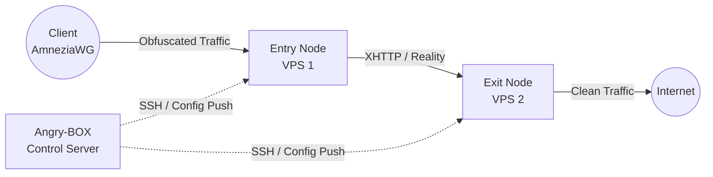

**Languages:** [English](README.md) | [Russian](README.ru.md) | [Chinese](README.zh.md) | [Farsi](README.fa.md)

# Angry-BOX

**Fully self-written SSH-only orchestrator / control plane.**

Angry-BOX is an original product written from scratch. It is **not** a fork of 3x-ui, LucX-UI, x-ui, or any other panel.

Management is done exclusively over SSH. Target nodes run **only** sing-box-extended with a minimal config — no agents.

<p>
  <a href="https://github.com/AlexeyLCP/angry-box/releases"></a>
  <a href="https://golang.org"></a>
  <a href="LICENSE"></a>
</p>


## Overview

**Angry-BOX** is a fully original, self-written orchestrator (control plane) for building and managing complex anti-DPI proxy infrastructure.

It drives **sing-box-extended** cores over SSH with zero agents on the nodes. The entire logic — chain composition, merged configs, rollback, UI, and deployment — was written from scratch.

## Features

- **Takeover an existing VPN server:** connect to a node running an existing VPN (AWG / awg-quick, sing-box, Xray/3x-ui, MTProxy/telemt), Angry-BOX detects it, warns you, and — on consent — installs sing-box, **converts the existing config to sing-box with the same settings**, disables (but does not delete) the old VPN, starts sing-box, and **auto-rolls back to the old VPN** if sing-box fails to come up.
- **Live QUIC signature capture:** fingerprint a real domain's QUIC silhouette (UDP→QUIC Initial with SNI=domain→capture server responses) and use it as AmneziaWG CPS I1-I5, so DPI sees traffic indistinguishable from real QUIC to that domain.
- **Import existing AmneziaWG configs:** pull the running server's AWG interface + peer list over SSH and back-fill it as a node's inbounds **non-destructively** (placeholder-only — never overwrites operator-set keys, ports, or presets). Lets you adopt an AWG box without re-typing anything.
- **Automated Orchestration:** no need to manually write complex `sing-box` JSON configs. Angry-BOX generates, validates, and deploys configs over SSH in seconds.
- **Advanced Obfuscation:** VLESS REALITY+XHTTP max obfuscation (ECH-less REALITY, tokenish padding, cookie placement, xmux, post-quantum curve support on the client), AmneziaWG (kernel + userspace), TUIC, Hysteria2, MTProxy FakeTLS — with 4 obfuscation levels (max/high/standard/minimal) and 45 routing presets (Telegram/YouTube/Netflix/…).
- **Multi-Hop Chains:** construct 2-node or 3-node proxy chains; AmneziaWG works both as a client entry point (kernel awg-quick + sing-box bind_interface) and as an inter-node hop (userspace wireguard endpoint with amnezia — the patched binary fixes the upstream `chacha20poly1305` panic that previously crashed kernel-mode AWG).
- **Failover & Load Balancing:** `urltest`, `failover`, `selector`, and a patched per-connection round-robin `fallback`.
- **Reliable deploy with rollback:** every apply does backup (cp, preserved) → cert → upload → `sing-box check` (stderr surfaced) → restart → real health-probe → rollback on failure; per-node lock prevents concurrent-deploy races.
- **Modern Web UI:** Spider-web topology editor (graph edges, persistent node positions, native SVG pan/zoom), deploy-status (pending-changes badge), audit log, profiles/services, unified clients, route rules — built with HTMX + TailwindCSS + DaisyUI + templ.
- **Background auto-apply:** per-user/inbound mutations trigger a background SSH deploy (hybrid mode); per-host lock serializes.
- **100% Independent:** Angry-BOX ships its own **patched sing-box-extended** binary (deps/), so weak VPSes never compile Go — they just download.
- **Zero-Footprint:** node servers run only the bare `sing-box` core; the orchestrator lives entirely on your control machine.

## Screenshots

<div align="center">
  
  <br>
  <em>The Angry-BOX Web UI Dashboard (v0.1.0)</em>
</div>

> Screenshots reflect the v0.1.0 rewrite (role-based config generation, takeover, spider-web graph editor, deploy-status, audit).

## Architecture

Unlike traditional panels that require heavy agents on every server, Angry-BOX takes a **stateless agentless approach**:



## Getting Started

### 1. Installation

Download the latest release for your platform from the [Releases](https://github.com/AlexeyLCP/angry-box/releases) page, or run the install script:

```bash
curl -fsSL https://raw.githubusercontent.com/AlexeyLCP/angry-box/main/scripts/install.sh | sh
```

### 2. Starting the Web UI

```bash
angry-box serve -listen 0.0.0.0:8090
```

*Note: On first run, a random secure password is generated for the Web UI.*

### 3. CLI Quick Start

```bash
# 1. Add your VPS nodes
angry-box host add entry-node --addr 1.2.3.4:22 --user root --key ~/.ssh/id_ed25519
angry-box host add exit-node --addr 5.6.7.8:22 --user root --key ~/.ssh/id_ed25519

# 2. Deploy the patched sing-box-extended to the nodes
#    (-sudo for non-root SSH users with passwordless sudo; -install-awg also installs the AmneziaWG kernel module)
angry-box deploy -addr 1.2.3.4 -key ~/.ssh/id_ed25519 -sudo
angry-box deploy -addr 5.6.7.8 -key ~/.ssh/id_ed25519 -sudo

# 3. Create a chain
angry-box chain create my-chain --nodes entry-node,exit-node --user-protocol awg --transport xhttp

# 4. Apply the chain (generates + pushes configs to all nodes, with rollback on failure)
angry-box apply-chain my-chain

# 5. Generate a standalone config locally (e.g. REALITY+XHTTP) without pushing
angry-box config -port 443
```

**Takeover** (detect + convert an existing VPN server) is available from the Web UI: open a node → **Takeover** button. It detects AWG/sing-box/Xray/MTProxy, converts the config to sing-box with the same settings, disables the old VPN, and auto-rolls back if sing-box fails.

## Third-Party Components

- **[sing-box](https://github.com/SagerNet/sing-box)** and **[sing-box-extended](https://github.com/shtorm-7/sing-box-extended)** (GPLv3)
- **[AmneziaWG Linux Kernel Module](https://github.com/amnezia-vpn/amneziawg-linux-kernel-module)** (GPLv2)
- **[awg-multi-script by pumbaX](https://github.com/pumbaX/awg-multi-script)** (MIT) — AmneziaWG obfuscation best practices (Jc/Jmin/Jmax/S1-S4/H1-H4 invariants, CPS packet generation)
- **[awg-manager by hoaxisr](https://github.com/hoaxisr/awg-manager)** (MIT) — live QUIC signature capture algorithm (the "Take over an existing VPN" capture logic: connect to domain:443 over UDP, send a QUIC Initial, capture server response packets as I1-I5)
- **[templ](https://github.com/a-h/templ)** (MIT) — HTML templating for the Web UI
- **[golang.org/x/crypto/ssh](https://go.googlesource.com/crypto)** (BSD-3-Clause) — Go SSH client
- **HTMX, TailwindCSS, and DaisyUI** (MIT / BSD)

## Acknowledgements

- Special thanks to **Aleksandr SacredX** for extensive testing and valuable ideas.
- The live QUIC signature capture (used by Angry-BOX to fingerprint a real domain's QUIC silhouette for AmneziaWG CPS I1-I5) is ported from **[hoaxisr/awg-manager](https://github.com/hoaxisr/awg-manager)**.
- AmneziaWG obfuscation parameter generation (profiles + invariants) and the synthesized CPS packet generators (TLS/DNS/SIP/QUIC ClientHello shapes for I1-I5) are ported from **[pumbaX/awg-multi-script](https://github.com/pumbaX/awg-multi-script)**.
- XHTTP transport + advanced obfuscation fields sourced from the **Xray team (RPRX)**; realistic HTTP header generation inspired by **[NaiveProxy](https://github.com/SagerNet/naive)**; chunk-fragmentation thinking adopted from the **Hysteria2 Gecko** design.
- **Hysteria2**, **NaiveProxy**, **Telemt**, and many Russian, Iranian, and Chinese anti-censorship researchers.

## Building from source

```bash
git clone https://github.com/AlexeyLCP/angry-box.git
cd angry-box

# Production build (everything embedded)
go build -o angry-box ./cmd/angry-box

# Dev mode (static files from disk, edits without rebuild)
ANGRY_BOX_DEV=1 go run ./cmd/angry-box serve
```

## License

**PolyForm Noncommercial License 1.0.0**

Free for personal, educational, and research purposes. Commercial use requires written permission.

See [LICENSE](LICENSE) for full text.
