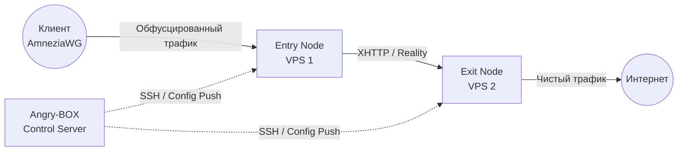

**Languages:** [English](README.md) | [Russian](README.ru.md) | [Chinese](README.zh.md) | [Farsi](README.fa.md)

# Angry-BOX

**Полностью самописный SSH-only orchestrator / control plane.**

Angry-BOX — оригинальный продукт, написанный с нуля. Не является форком 3x-ui, LucX-UI, x-ui или любой другой панели.

Управление исключительно по SSH. На целевых нодах нет агентов — только ядро **sing-box-extended** (и опционально xray) + минимальный конфиг.

## Обзор

**Angry-BOX** — полностью оригинальный, самописный оркестратор (control plane) для построения и управления сложной анти-DPI прокси-инфраструктурой.

Он управляет ядрами **sing-box-extended** по SSH без агентов на нодах. Вся логика — композиция цепей, генерация по ролям, откат, UI и деплой — написана с нуля.

## Возможности

- **Захват существующего VPN-сервера (takeover):** подключение к ноде с работающим VPN (AWG / awg-quick, sing-box, Xray/3x-ui, MTProxy/telemt) → Angry-BOX обнаруживает его, предупреждает и — по согласию — ставит sing-box, **конвертирует существующий конфиг в sing-box с теми же настройками**, отключает (но не удаляет) старый VPN, запускает sing-box и **автоматически откатывается на старый VPN**, если sing-box не поднялся.
- **Живой захват QUIC-сигнатуры:** снятие отпечатка реального QUIC-силуэта домена (UDP→QUIC Initial с SNI=domain→захват ответов сервера) и использование его как AmneziaWG CPS I1-I5, чтобы DPI видел трафик, неотличимый от настоящего QUIC к этому домену.
- **Автоматическая оркестрация:** не нужно писать сложные JSON-конфиги `sing-box` вручную. Angry-BOX генерирует, валидирует и деплоит конфиги по SSH за секунды.
- **Продвинутая обфускация:** VLESS REALITY+XHTTP max obfuscation (REALITY без ECH, tokenish padding, cookie placement, xmux, поддержка пост-квантовых кривых на клиенте), AmneziaWG (kernel + userspace), TUIC, Hysteria2, MTProxy FakeTLS — с 4 уровнями обфускации (max/high/standard/minimal) и 45 пресетами маршрутизации (Telegram/YouTube/Netflix/…).
- **Multi-hop цепи:** 2- и 3-узловые прокси-цепи; AmneziaWG работает и как клиентская точка входа (kernel awg-quick + sing-box bind_interface), и как межузловой hop (userspace wireguard endpoint с amnezia — патченный бинарь чинит upstream-панику `chacha20poly1305`, которая ранее роняла kernel-mode AWG).
- **Failover и балансировка:** `urltest`, `failover`, `selector` и патченный per-connection round-robin `fallback`.
- **Надёжный деплой с откатом:** каждый apply делает backup (cp, сохраняется) → cert → upload → `sing-box check` (stderr поднимается) → restart → реальный health-probe → откат при провале; per-node lock исключает гонки параллельных деплоев.
- **Современный Web UI:** паутина-редактор топологии (рёбра графа, персистентные позиции узлов, нативный SVG pan/zoom), deploy-status (бейдж pending-changes), журнал аудита, профили/сервисы, единый список клиентов, route rules — на HTMX + TailwindCSS + DaisyUI + templ.
- **Фоновый auto-apply:** мутации юзеров/inbound'ов триггерят фоновый SSH-деплой (hybrid-режим); per-host lock сериализует.
- **100% независимость:** Angry-BOX поставляет собственный **патченный sing-box-extended** бинарь (deps/), поэтому слабые VPS не компилируют Go — просто скачивают.
- **Zero-Footprint:** на нодах работает только ядро `sing-box`; оркестратор живёт на твоей управляющей машине.

## Скриншоты

<div align="center">
  
  <br>
  <em>Dashboard Angry-BOX Web UI (v0.1.0)</em>
</div>

> Скриншоты отражают переписанный v0.1.0 (генерация по ролям, takeover, паутина-граф, deploy-status, аудит).

## Архитектура

В отличие от традиционных панелей, требующих тяжёлых агентов на каждом сервере, Angry-BOX использует **stateless agentless-подход**:



## Начало работы

### 1. Установка

Скачай последний релиз со страницы [Releases](https://github.com/AlexeyLCP/angry-box/releases) или запусти установочный скрипт:

```bash
curl -fsSL https://raw.githubusercontent.com/AlexeyLCP/angry-box/main/scripts/install.sh | sh
```

### 2. Запуск Web UI

```bash
angry-box serve -listen 0.0.0.0:8090
```

*Примечание: при первом запуске генерируется случайный безопасный пароль для Web UI.*

### 3. CLI Quick Start

```bash
# 1. Добавь свои VPS-ноды
angry-box host add entry-node --addr 1.2.3.4:22 --user root --key ~/.ssh/id_ed25519
angry-box host add exit-node --addr 5.6.7.8:22 --user root --key ~/.ssh/id_ed25519

# 2. Задеплой патченный sing-box-extended на ноды
#    (-sudo для non-root SSH-юзеров с passwordless sudo; -install-awg также ставит модуль ядра AmneziaWG)
angry-box deploy -addr 1.2.3.4 -key ~/.ssh/id_ed25519 -sudo
angry-box deploy -addr 5.6.7.8 -key ~/.ssh/id_ed25519 -sudo

# 3. Создай цепь
angry-box chain create my-chain --nodes entry-node,exit-node --user-protocol awg --transport xhttp

# 4. Примени цепь (генерит + пушит конфиги на все ноды, с откатом при провале)
angry-box apply-chain my-chain

# 5. Сгенерируй standalone-конфиг локально (например REALITY+XHTTP) без пуша
angry-box config -port 443
```

**Takeover** (обнаружить + конвертировать существующий VPN-сервер) доступен из Web UI: открой ноду → кнопка **Takeover**. Он обнаруживает AWG/sing-box/Xray/MTProxy, конвертирует конфиг в sing-box с теми же настройками, отключает старый VPN и автоматически откатывается, если sing-box не поднялся.

## Сторонние компоненты

- **[sing-box](https://github.com/SagerNet/sing-box)** и **[sing-box-extended](https://github.com/shtorm-7/sing-box-extended)** (GPLv3)
- **[AmneziaWG Linux Kernel Module](https://github.com/amnezia-vpn/amneziawg-linux-kernel-module)** (GPLv2)
- **[awg-multi-script от pumbaX](https://github.com/pumbaX/awg-multi-script)** (MIT) — практики обфускации AmneziaWG (инварианты Jc/Jmin/Jmax/S1-S4/H1-H4, генерация CPS-пакетов)
- **[awg-manager от hoaxisr](https://github.com/hoaxisr/awg-manager)** (MIT) — алгоритм живого захвата QUIC-сигнатуры (логика «захвата существующего VPN»: подключение к domain:443 по UDP, отправка QUIC Initial, захват ответных пакетов сервера как I1-I5)
- **[templ](https://github.com/a-h/templ)** (MIT) — HTML-шаблоны для Web UI
- **[golang.org/x/crypto/ssh](https://go.googlesource.com/crypto)** (BSD-3-Clause) — Go SSH-клиент
- **HTMX, TailwindCSS, DaisyUI** (MIT / BSD)

## Благодарности

- Особая благодарность **Aleksandr SacredX** за обширное тестирование и ценные идеи.
- Живой захват QUIC-сигнатуры (используется Angry-BOX для снятия отпечатка QUIC-силуэта реального домена под AmneziaWG CPS I1-I5) портирован из **[hoaxisr/awg-manager](https://github.com/hoaxisr/awg-manager)**.
- Генерация параметров обфускации AmneziaWG (профили + инварианты) и синтезированные генераторы CPS-пакетов (формы TLS/DNS/SIP/QUIC ClientHello для I1-I5) портированы из **[pumbaX/awg-multi-script](https://github.com/pumbaX/awg-multi-script)**.
- XHTTP-транспорт и продвинутые поля обфускации — от **команды Xray (RPRX)**; реалистичная генерация HTTP-заголовков вдохновлена **[NaiveProxy](https://github.com/SagerNet/naive)**.
- **Hysteria2**, **NaiveProxy**, **Telemt** и многие российские, иранские и китайские исследователи анти-цензуры.

## Сборка из исходников

```bash
git clone https://github.com/AlexeyLCP/angry-box.git
cd angry-box

# Production-сборка (всё встроено)
go build -o angry-box ./cmd/angry-box

# Dev-режим (статика с диска, правки без пересборки)
ANGRY_BOX_DEV=1 go run ./cmd/angry-box serve
```

## Лицензия

**PolyForm Noncommercial License 1.0.0**

Свободно для личного, образовательного и исследовательского использования. Коммерческое использование требует письменного разрешения.

См. [LICENSE](LICENSE) для полного текста.