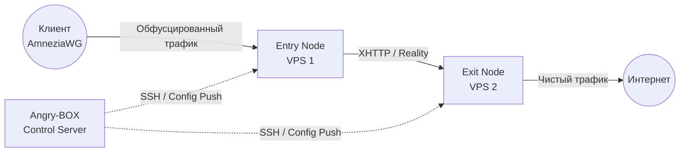

**Languages:** [English](README.md) | [Russian](README.ru.md) | [Chinese](README.zh.md) | [Farsi](README.fa.md)

# Angry-BOX

**Полностью самописный SSH-only orchestrator / control plane.**

Angry-BOX — оригинальный продукт, написанный с нуля. Не является форком 3x-ui, LucX-UI, x-ui или любой другой панели.

Управление исключительно по SSH. На целевых нодах нет агентов — только ядро **amnezia-box** (наш форк sing-box 1.14) + минимальный конфиг.

## Обзор

**Angry-BOX** — полностью оригинальный, самописный оркестратор (control plane) для построения и управления сложной анти-DPI прокси-инфраструктурой.

Он управляет ядрами **amnezia-box** (нашего форка sing-box 1.14) по SSH без агентов на нодах. Вся логика — композиция цепей, генерация по ролям, per-user-материал, отслеживание здоровья нод, откат, UI и деплой — написана с нуля.

## Возможности

- **Захват существующего VPN-сервера (takeover):** подключение к ноде с работающим VPN (AWG / awg-quick, sing-box, Xray/3x-ui, MTProxy/telemt) → Angry-BOX обнаруживает его, предупреждает и — по согласию — ставит sing-box, **конвертирует существующий конфиг в sing-box с теми же настройками**, отключает (но не удаляет) старый VPN, запускает sing-box и **автоматически откатывается на старый VPN**, если sing-box не поднялся.
- **Живой захват QUIC-сигнатуры:** снятие отпечатка реального QUIC-силуэта домена (UDP→QUIC Initial с SNI=domain→захват ответов сервера) и использование его как AmneziaWG CPS I1-I5, чтобы DPI видел трафик, неотличимый от настоящего QUIC к этому домену.
- **Импорт существующих AmneziaWG-конфигов:** подтягивание AWG-интерфейса + списка пиров работающего сервера по SSH и back-fill в inbound'ы ноды **неразрушающе** (placeholder-only — никогда не перезаписывает ключи, порты и пресеты, заданные оператором). Позволяет принять AWG-бокс без перепечатывания.
- **Автоматическая оркестрация:** не нужно писать сложные JSON-конфиги `sing-box` вручную. Angry-BOX генерирует, валидирует и деплоит конфиги по SSH за секунды.
- **Продвинутая обфускация (product focus v0.2.x):** AmneziaWG (kernel + balancer), VLESS REALITY+XHTTP max obfuscation, MTProxy/Telemt FakeTLS — с 4 уровнями обфускации (max/high/standard/minimal) и 45 пресетами маршрутизации (Telegram/YouTube/Netflix/…). TUIC и Hysteria2 **на паузе** (QUIC/TLS cert — отложено).
- **Multi-hop цепи:** 2- и 3-узловые прокси-цепи; AmneziaWG работает и как клиентская точка входа (kernel awg-quick + sing-box bind_interface), и как межузловой hop (userspace wireguard endpoint с amnezia — патченный бинарь чинит upstream-панику `chacha20poly1305`, которая ранее роняла kernel-mode AWG).
- **First-class инбаунды (v0.8):** профили инбаундов (AWG / VLESS+REALITY / MTProxy) создаются один раз и раскладываются по любому набору нод с per-node кредами — при правке профиля передеплоиваются только затронутые ноды. Цепочки ссылаются на развёрнутые инбаунды, а не владеют слушателями.
- **Уровни цепочек со стратегиями балансировки (v0.8):** цепочка — упорядоченные уровни из групп нод — `Вход → [Hop-1, Hop-2] → [Exit-1, Exit-2, Exit-3]` — со стратегией на уровень: Round-robin (fallback, дефолт — патченая per-connection балансировка), urltest, failover, selector.
- **Упрощённые Клиенты (v0.8):** добавить клиента = имя + цепочки; AWG-пиры и VLESS UUID выводятся автоматически. Subscription URL, конфиги по цепочкам и QR-коды прилагаются.
- **Failover и балансировка:** `urltest`, `failover`, `selector` и патченный per-connection round-robin `fallback`.
- **Надёжный деплой с откатом:** каждый apply делает backup (cp, сохраняется) → cert → upload → `sing-box check` (stderr поднимается) → restart → реальный health-probe → откат при провале; per-node lock исключает гонки параллельных деплоев.
- **Современный Web UI:** паутина-редактор топологии (рёбра графа, персистентные позиции узлов, нативный SVG pan/zoom), deploy-status (бейдж pending-changes), журнал аудита, профили/сервисы, единый список клиентов, route rules — на HTMX + TailwindCSS + DaisyUI + templ.
- **Фоновый auto-apply:** мутации юзеров/inbound'ов триггерят фоновый SSH-деплой (hybrid-режим); per-host lock сериализует.
- **Бэкапы + быстрое перемещение ноды:** экспорт всей панели (или портативной идентичности одной ноды) в JSON-бэкап и восстановление/миграция; если IP ноды заблокирован, **Relocate** переносит её на новый VPS — сохраняя transit-ключи ноды, чтобы остальные ноды и существующие клиенты НЕ переконфигурировались — и ре-деплоит все цепи, содержащие ноду, чтобы новый IP разнёсся по зависимым хопам автоматически (кнопка в UI + `angry-box relocate` CLI). **Клон** ноды создаёт реплику со свежим identity (перегенерённые ключи/порты + заново выделенный AWG /24-subnet, копируется ForUsers + ExitTargets).
- **Шифрованные offsite-бэкапы:** выгрузка шифрованной, защищённой passphrase-копии всей панели на удалённый хост по SSH по расписанию и по требованию (scrypt KDF + AES-256-GCM; настраиваемый scrypt N; retention по N блобов с серверной ротацией `ls`/`rm`). Мастер-ключ никогда не покидает твою управляющую машину — passphrase для offsite отдельная.
- **State-machine здоровья ноды:** каждая нода опрашивается и отслеживается через `healthy → suspect → down → unreachable` с гистерезисом (down после N подряд провалов, recover после M подряд OK), плюс operator-marked **blocked** (липкое до очистки). Переходы состояний пишутся в аудит и видны в UI (бейдж статуса на каждой ноде + счётчики по состояниям на дашборде).
- **Users wizard + Service model:** добавление юзера через направляемый wizard (выбор цепей → выбор протоколов → AWG-адрес юзера), просмотр синтезированного **Service** (слитый вид юзера по всем цепям) и готовая **subscription URL**, которая отдаёт клиенту нужный конфиг по цепи.
- **Авто-перенос (тёплый пул):** когда health-монитор переводит ноду в down/unreachable, оркестратор может автоматически перенести её на **запасной VPS** — opt-in на ноде И глобально, с кулдауном и аудитом каждого решения. Нода сохраняет идентичность (ключи/порты) — клиенты ничего не замечают.
- **Управление юзерами без даунтайма:** деплои, меняющие только набор пиров (добавление/удаление юзера), применяются **live через `awg set`** — без рестарта `awg-quick`, без обрыва клиентов. Изменение интерфейса по-прежнему рестартит (как и должно).
- **AWG-диагностика:** одна кнопка на строке ноды (**Diagnose**) глубоко проверяет data-plane по SSH — состояние интерфейса, свежесть handshake'ов, ip_forward, rp_filter, FORWARD-правила в TUN-overlay, здоровье sing-box — каждый чек с прочитанными на ноде данными.
- **Per-user учёт трафика:** kernel-счётчики per-peer (`awg show transfer`) фолдятся в накопительные байты юзера (peer = AWG-идентичность юзера), устойчиво к рестартам, колонка в таблице юзеров.
- **Самолечение NAT:** health-цикл восстанавливает FORWARD/MASQUERADE-правила, когда fail2ban или Docker сбрасывают iptables (тихий убийца egress'а) — лечится автоматически, пишется в аудит.
- **Пакеты для роутеров (Keenetic + OpenWrt):** готовые `.ipk` для Keenetic Entware (mipsel/mips/aarch64, с NDMS-хуками интерфейсов) и OpenWrt (procd) — stripped + UPX (~3 МБ), smoke-тест под qemu в CI. Скачивание при деплое переживает зеркала (`ANGRY_BINARY_MIRRORS`), когда GitHub недоступен из сети ноды.
- **100% независимость:** Angry-BOX поставляет собственный бинарь **amnezia-box** (нашего форка sing-box 1.14) (deps/), поэтому слабые VPS не компилируют Go — просто скачивают.
- **Zero-Footprint:** на нодах работает только ядро `sing-box`; оркестратор живёт на твоей управляющей машине.

## Скриншоты

<div align="center">
  
  <br>
  <em>Dashboard Angry-BOX Web UI</em>
  <br><br>
  
  <br>
  <em>Паутина-редактор топологии — граф multi-hop-цепи</em>
  <br><br>
  
  <br>
  <em>Пользователи — протоколы юзера, доступ к цепям, lifecycle-статус</em>
</div>

> Скриншоты отражают текущий билд (state-machine здоровья ноды, users wizard, clone/relocate, шифрованные offsite-бэкапы, паутина-граф, deploy-status, takeover, аудит).

## Архитектура

В отличие от традиционных панелей, требующих тяжёлых агентов на каждом сервере, Angry-BOX использует **stateless agentless-подход**:



## Начало работы

### 1. Установка

Скачай последний релиз со страницы [Releases](https://github.com/AlexeyLCP/angry-box/releases) или запусти установочный скрипт:

```bash
curl -fsSL https://raw.githubusercontent.com/AlexeyLCP/angry-box/main/scripts/install.sh | sh
```

### 2. Запуск Web UI

```bash
angry-box serve -listen 0.0.0.0:8090
```

*Примечание: при первом запуске генерируется случайный безопасный пароль для Web UI.*

### 3. CLI Quick Start

```bash
# 1. Добавь свои VPS-ноды
angry-box host add entry-node --addr 1.2.3.4:22 --user root --key ~/.ssh/id_ed25519
angry-box host add exit-node --addr 5.6.7.8:22 --user root --key ~/.ssh/id_ed25519

# 2. Задеплой бинарь amnezia-box на ноды
#    (-sudo для non-root SSH-юзеров с passwordless sudo; -install-awg также ставит модуль ядра AmneziaWG)
angry-box deploy -addr 1.2.3.4 -key ~/.ssh/id_ed25519 -sudo
angry-box deploy -addr 5.6.7.8 -key ~/.ssh/id_ed25519 -sudo

# 3. Создай цепь
angry-box chain create my-chain --nodes entry-node,exit-node --user-protocol awg --transport xhttp

# 4. Примени цепь (генерит + пушит конфиги на все ноды, с откатом при провале)
angry-box apply-chain my-chain

# 5. Сгенерируй standalone-конфиг локально (например REALITY+XHTTP) без пуша
angry-box config -port 443
```

### 4. На роутере (Keenetic / OpenWrt)

```bash
# Keenetic (Entware) — выбери пакет под свою модель из Releases:
opkg install angry-box_v0.7.0_mipsel-3.4-kn.ipk      # MT7621 и подобные
# OpenWrt:
opkg install angry-box_v0.7.0_aarch64_cortex-a53.ipk
# Панель поднимется на 127.0.0.1:9080 (loopback) — доступ через SSH-туннель.
```

**Takeover** (обнаружить + конвертировать существующий VPN-сервер) доступен из Web UI: открой ноду → кнопка **Takeover**. Он обнаруживает AWG/sing-box/Xray/MTProxy, конвертирует конфиг в sing-box с теми же настройками, отключает старый VPN и автоматически откатывается, если sing-box не поднялся.

## Сторонние компоненты

- **[sing-box](https://github.com/SagerNet/sing-box)** и **[amnezia-box](https://github.com/AlexeyLCP/amnezia-box)** (our sing-box 1.14 fork, GPLv3)
- **[AmneziaWG Linux Kernel Module](https://github.com/amnezia-vpn/amneziawg-linux-kernel-module)** (GPLv2)
- **[awg-multi-script от pumbaX](https://github.com/pumbaX/awg-multi-script)** (MIT) — практики обфускации AmneziaWG (инварианты Jc/Jmin/Jmax/S1-S4/H1-H4, генерация CPS-пакетов)
- **[awg-manager от hoaxisr](https://github.com/hoaxisr/awg-manager)** (MIT) — алгоритм живого захвата QUIC-сигнатуры (логика «захвата существующего VPN»: подключение к domain:443 по UDP, отправка QUIC Initial, захват ответных пакетов сервера как I1-I5)
- **[templ](https://github.com/a-h/templ)** (MIT) — HTML-шаблоны для Web UI
- **[golang.org/x/crypto/ssh](https://go.googlesource.com/crypto)** (BSD-3-Clause) — Go SSH-клиент
- **HTMX, TailwindCSS, DaisyUI** (MIT / BSD)

## Благодарности

- Особая благодарность **Aleksandr SacredX** за обширное тестирование и ценные идеи.
- Живой захват QUIC-сигнатуры (используется Angry-BOX для снятия отпечатка QUIC-силуэта реального домена под AmneziaWG CPS I1-I5) портирован из **[hoaxisr/awg-manager](https://github.com/hoaxisr/awg-manager)**.
- Генерация параметров обфускации AmneziaWG (профили + инварианты) и синтезированные генераторы CPS-пакетов (формы TLS/DNS/SIP/QUIC ClientHello для I1-I5) портированы из **[pumbaX/awg-multi-script](https://github.com/pumbaX/awg-multi-script)**.
- XHTTP-транспорт и продвинутые поля обфускации — от **команды Xray (RPRX)**; реалистичная генерация HTTP-заголовков вдохновлена **[NaiveProxy](https://github.com/SagerNet/naive)**; мышление о chunk-фрагментации заимствовано из дизайна **Hysteria2 Gecko**.
- **Hysteria2**, **NaiveProxy**, **Telemt** и многие российские, иранские и китайские исследователи анти-цензуры.

## Сборка из исходников

```bash
git clone https://github.com/AlexeyLCP/angry-box.git
cd angry-box

# Production-сборка (всё встроено)
go build -o angry-box ./cmd/angry-box

# Dev-режим (статика с диска, правки без пересборки)
ANGRY_BOX_DEV=1 go run ./cmd/angry-box serve
```

## ☕ Поддержать проект

Angry-BOX бесплатен для личного и некоммерческого использования. Если оркестратор экономит тебе время — можно поддержать разработку:

| Способ | Реквизиты |
|---|---|
| 🇷🇺 **ЮMoney** (рубли, РФ) | [yoomoney.ru/to/41001989176429](https://yoomoney.ru/to/41001989176429) |
| 💎 **USDT (TON)** | `UQC48dE4i35bjEU4jljx0h1CGeXMu77eKZwN5W4gbcibmqDs` |
| 💠 **USDT (ERC-20)** | `0xA49aBc042c5BB3d682788D3DEB2eAC833343a873` |

Донаты — это благодарность, а не покупка: они не дают коммерческой лицензии и не меняют условия лицензии ниже.

## Лицензия

**PolyForm Noncommercial License 1.0.0**

Свободно для личного, образовательного и исследовательского использования. Коммерческое использование требует письменного разрешения.

См. [LICENSE](LICENSE) для полного текста.