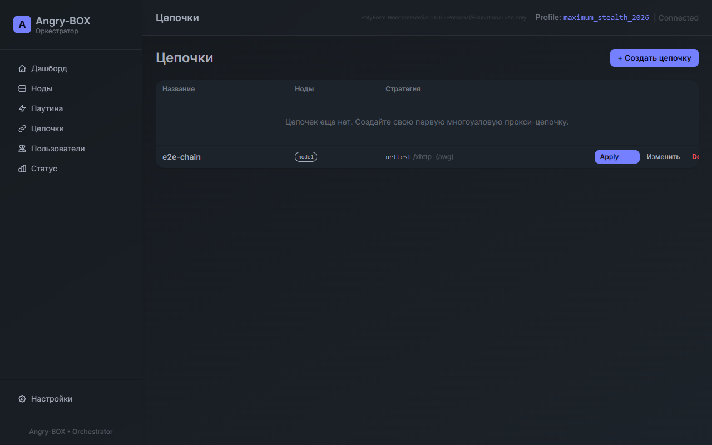

**Languages:** [English](README.md) | [Russian](README.ru.md) | [Chinese](README.zh.md) | [Farsi](README.fa.md)

# Angry-BOX

**Полностью самописный SSH-only orchestrator / control plane.**

Angry-BOX — оригинальный продукт, написанный с нуля. Не является форком 3x-ui, LucX-UI, x-ui или любой другой панели.

Управление исключительно по SSH. На целевых нодах нет агентов — только ядро **sing-box-extended** (и опционально xray) + минимальный конфиг.

## Features

- Pure SSH management without persistent agents on targets
- Powerful 2026 obfuscation presets (Russia / Iran / China / Maximum Stealth)
- Advanced AWG with CPS generators + realistic QUIC/SIP/DNS
- High-quality XHTTP (padding, XMUX, realistic headers) on both backends
- Stable user credentials (AWG keys + CPS generated once)
- Excellent router support (Keenetic .ipk + OpenWRT)
- Native Windows build
- Web UI + full CLI

## Что нового в v0.8.0

**Стабильный деплой + sing-box-extended + E2E-тесты:**

- **Полный цикл CLI**: `host add → deploy → chain create → apply-chain` — работает без ручного вмешательства.
- **Полный цикл Web UI**: создание пользователя → конфиг → QR-код — всё генерируется корректно.
- **sing-box-extended** устанавливается автоматически через `angry-box deploy` из локальных deps (не зависит от внешних репозиториев).
- **AWG + amnezia**: поддержка CPS/I1-I5 пакетов, авто-генерация клиентских ключей.
- **TUIC**: автоматическая генерация self-signed сертификатов (Reality на TUIC не поддерживается).
- **14 багов исправлено**: двойной порт в URI, DNS detour, права на лог-файл, пустая форма inbound, и др.
- **Тёмная/светлая тема**: переключатель с сохранением в localStorage.
- **QR-коды**: серверная генерация через go-qrcode (без Google Charts API).
- **170+ тестов**: покрытие chain 67.6%, E2E-тесты на реальных серверах GCloud.
- **3 тестовых сервера** в GCloud для CI/E2E.

## Что нового в v0.7.2

**Исправления и стабилизация (после v0.7.1):**
- Исправлена потеря данных Host при сохранении Standalone Inbounds.
- Устранён конфликт Standalone Inbounds и Chain Transport Inbounds (через перехват ApplyStandaloneNode).
- Исправлены два бага с `flow: "xtls-rprx-vision"`.
- Проверен и работает Graceful Rollback на реальном трафике (невалидный конфиг → автоматический откат на предыдущую рабочую версию).
- Улучшен сбор тегов outbounds в merged config builder (исправлены пропущенные теги).

## Что нового в v0.7.1

- **Единая конфигурация узла (Merged Config)** — теперь узлы могут одновременно обслуживать независимые подключения (standalone inbounds) И участвовать в нескольких цепочках. Новый механизм `apply-merged` генерирует единый `config.json`, объединяя независимые подключения, транспортные входящие подключения цепочек, пользовательские входы цепочек и унифицированную маршрутизацию/DNS. Больше никаких перезаписей конфигов!
- **Предварительная проверка SSH** — проверка SSH-доступа ко всем узлам ДО внесения изменений в удаленные конфиги, предотвращающая частичное развертывание цепочек.
- **Обнаружение конфликта портов** — сборщик конфигов (merged config builder) обнаруживает конфликты портов между цепочками и независимыми подключениями до развертывания.
- **Отображение Diff по тегам** — после каждого применения в UI отображаются добавленные (`+tag`) и удаленные (`-tag`) теги входящих подключений (inbounds/endpoints).
- **Автоматическая генерация SSH-ключей** — UI для добавления узла теперь может автоматически генерировать пару SSH-ключей и устанавливать их на удаленные хосты.
- **Поддержка i18n** — Web UI доступен на английском, русском, китайском и персидском языках.
- **Конфигурация Standalone-узлов** — возможность применять настройки к отдельным узлам независимо от цепочек, с той же надежной системой отката при сбоях (rollback).

## Quick Start

```bash
# 1. Install
curl -fsSL https://raw.githubusercontent.com/alexeylcp/angry-box/main/scripts/install.sh | sh

# 2. Add host
angry-box host add node1 --addr 203.0.113.10:22 --user root --key ~/.ssh/id_ed25519

# 3. Create chain with strong 2026 preset
angry-box chain create mychain --nodes node1 --strategy urltest --profile pro_2026 --transport xhttp --user-protocol awg

# 4. Deploy (uses merged config!)
angry-box apply-chain mychain

# 5. Or apply merged config for a single node
angry-box apply-merged node1
```

Web UI available at `http://localhost:8090`.

## Скриншоты

<div align="center">
  
  <br>
  <em>Dashboard Angry-BOX (тёмная тема, поддержка merged config)</em>
</div>

<div align="center">
  
  <br>
  <em>Страница цепочек (русский интерфейс, v0.7.2)</em>
</div>

> Скриншоты обновлены для актуальной версии UI.

## Installation

### Install script (recommended)

```bash
# Latest version
curl -fsSL https://raw.githubusercontent.com/alexeylcp/angry-box/main/scripts/install.sh | sh

# Specific version
curl -fsSL https://raw.githubusercontent.com/alexeylcp/angry-box/main/scripts/install.sh | sh -s -- --version 0.7.2
```

### Pre-built binaries

Download from [Releases](https://github.com/alexeylcp/angry-box/releases).

**Linux**
```bash
tar -xzf angry-box-0.7.2-linux-amd64.tar.gz
cd angry-box-0.7.2-linux-amd64
./angry-box --help
```

**Windows**
- Download `angry-box-0.7.2-windows-amd64.zip` or `.exe`
- Unpack and run `angry-box.exe`
- Web UI: `http://localhost:8090`

### Routers (Keenetic / OpenWRT)

See detailed instructions below.

## Architecture

Angry-BOX is only the **control plane**.

- The orchestrator itself never proxies traffic.
- All management is via SSH.
- Remote nodes only run a lightweight proxy (sing-box or xray) + minimal config.

**Two connection types:**
- **Transport** -- technical hops linking the chain (XHTTP recommended)
- **User** -- real entry points for clients (TUIC v5 or AmneziaWG)

## 2026 Stealth Presets

The project ships with modern presets optimized for current DPI systems:

| Preset                    | Target             | Key techniques                      |
|---------------------------|--------------------|-------------------------------------|
| `russia_2026`             | Russia             | Balanced XHTTP + AWG                |
| `iran_2026`               | Iran               | Aggressive XHTTP + Reality          |
| `china_2026`              | China              | Strong obfuscation + fragmentation  |
| `maximum_stealth_2026`    | Maximum stealth    | Full XHTTP + AWG CPS                |
| `pro_2026`                | Professional use   | Forced CPS level 3 + QUIC 1200B     |
| `xhttp_max_stealth_2026`  | Extreme XHTTP      | Maximum padding + XMUX              |

## Router Support

Angry-BOX provides native `.ipk` packages.

| Platform          | Architecture           | Example package                           |
|-------------------|------------------------|-------------------------------------------|
| Keenetic          | `mipsel_24kc`          | `angry-box_X.Y.Z_mipsel_24kc.ipk`         |
| Keenetic/OpenWRT  | `aarch64_cortex-a53`   | `angry-box_X.Y.Z_aarch64_cortex-a53.ipk`  |

All router packages use **outer-tar** format and fully static binaries.

## Building from source

```bash
git clone https://github.com/alexeylcp/angry-box.git
cd angry-box

# Production build (everything embedded)
make build

# Dev mode (static files from disk, edits without rebuild)
make dev
```

## Acknowledgements

Angry-BOX is built on anti-censorship community research.

**Key sources:**
- **[hoaxisr/awg-manager](https://github.com/hoaxisr/awg-manager)** (MIT) — алгоритм живого захвата QUIC-сигнатуры (live QUIC capture: подключение к domain:443 по UDP, отправка QUIC Initial с SNI=domain, захват ответных пакетов сервера как I1-I5). Используется Angry-BOX для формирования CPS-пакетов под реальный домен.
- **[pumbaX/awg-multi-script](https://github.com/pumbaX/awg-multi-script)** (MIT) — генераторы CPS (QUIC, SIP, DNS), обфускация AmneziaWG (профили Jc/Jmin/Jmax/S1-S4/H1-H4 + инварианты).
- Xray (RPRX) — XHTTP-транспорт и продвинутая обфускация
- Hysteria2, NaiveProxy, Telemt и многие российские, иранские и китайские исследователи

**Third-Party Components:**
- **[sing-box](https://github.com/SagerNet/sing-box)** и **[sing-box-extended](https://github.com/shtorm-7/sing-box-extended)** (GPLv3)
- **[AmneziaWG Linux Kernel Module](https://github.com/amnezia-vpn/amneziawg-linux-kernel-module)** (GPLv2)
- **[templ](https://github.com/a-h/templ)** (MIT) — HTML-шаблоны для Web UI
- **[golang.org/x/crypto/ssh](https://go.googlesource.com/crypto)** (BSD-3-Clause) — Go SSH-клиент
- **HTMX, TailwindCSS, DaisyUI** (MIT / BSD)

## License

**PolyForm Noncommercial License 1.0.0**

Free for personal, non-commercial, educational, and scientific use.
**Any commercial use is prohibited.**

See [LICENSE](LICENSE) for full text.

## Support

- Bugs and features -> [GitHub Issues](https://github.com/alexeylcp/angry-box/issues)
- General discussion -> GitHub Discussions
- Real-world DPI test results (Russia, Iran, China) are highly valued.

---

****Current version:** 0.8.0 -- unified merged config, pre-flight checks, i18n, standalone config.
