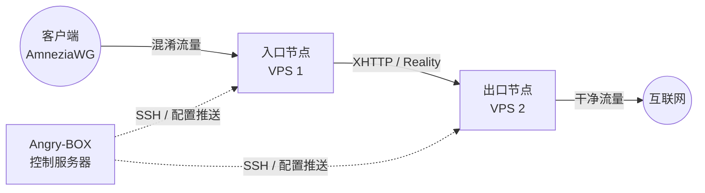

**Languages:** [English](README.md) | [Russian](README.ru.md) | [Chinese](README.zh.md) | [Farsi](README.fa.md)

# Angry-BOX

**完全自研的 SSH-only orchestrator / control plane。**

Angry-BOX 是从零开始编写的原创产品，不是 3x-ui、LucX-UI、x-ui 或任何其他面板的 fork。

所有管理均通过 SSH 完成，目标节点上只运行 **sing-box-extended**（可选 xray）内核 + 最小配置，无任何 agent。

## 概览

**Angry-BOX** 是一个完全原创、自研的编排器（控制平面），用于构建和管理复杂的抗 DPI 代理基础设施。

它通过 SSH 驱动 **sing-box-extended** 内核，节点上零 agent。全部逻辑——链式组合、基于角色的配置生成、回滚、UI 和部署——均从零编写。

## 功能

- **接管现有 VPN 服务器（takeover）：** 连接到运行现有 VPN（AWG / awg-quick、sing-box、Xray/3x-ui、MTProxy/telemt）的节点 → Angry-BOX 检测到它、发出警告，并在同意后安装 sing-box，**将现有配置转换为相同设置的 sing-box 配置**，禁用（但不删除）旧 VPN，启动 sing-box，如果 sing-box 启动失败则**自动回滚到旧 VPN**。
- **实时 QUIC 签名捕获：** 获取真实域名的 QUIC 轮廓（UDP→QUIC Initial with SNI=domain→捕获服务器响应），用作 AmneziaWG CPS I1-I5，使 DPI 看到的流量与该域名的真实 QUIC 不可区分。
- **自动化编排：** 无需手动编写复杂的 `sing-box` JSON 配置。Angry-BOX 通过 SSH 在几秒内生成、验证并部署配置。
- **高级混淆：** VLESS REALITY+XHTTP max obfuscation（无 ECH 的 REALITY、tokenish 填充、cookie 放置、xmux、客户端侧后量子曲线支持），AmneziaWG（内核 + 用户态），TUIC，Hysteria2，MTProxy FakeTLS — 提供 4 个混淆级别（max/high/standard/minimal）和 45 个路由预设（Telegram/YouTube/Netflix/…）。
- **多跳链：** 构建 2 节点或 3 节点代理链；AmneziaWG 既可作为客户端入口点（内核 awg-quick + sing-box bind_interface），也可作为节点间跳（带 amnezia 的用户态 wireguard endpoint — 修补后的二进制修复了之前导致内核模式 AWG 崩溃的上游 `chacha20poly1305` panic）。
- **故障转移与负载均衡：** `urltest`、`failover`、`selector`，以及修补后的 per-connection round-robin `fallback`。
- **带回滚的可靠部署：** 每次应用都执行 backup（cp，保留）→ cert → upload → `sing-box check`（显示 stderr）→ restart → 真实健康探测 → 失败时回滚；per-node lock 防止并发部署竞争。
- **现代 Web UI：** 蛛网拓扑编辑器（图边、持久化节点位置、原生 SVG 平移/缩放）、部署状态（待处理变更徽章）、审计日志、配置文件/服务、统一客户端、路由规则 — 基于 HTMX + TailwindCSS + DaisyUI + templ 构建。
- **后台自动应用：** 用户/inbound 变更触发后台 SSH 部署（混合模式）；per-host lock 序列化。
- **100% 独立：** Angry-BOX 附带自己的**修补版 sing-box-extended** 二进制文件（deps/），因此弱 VPS 无需编译 Go — 直接下载。
- **零占用：** 节点服务器仅运行裸 `sing-box` 核心；编排器完全位于你的控制机上。

## 截图

<div align="center">
  
  <br>
  <em>Angry-BOX Web UI 仪表盘 (v0.1.0)</em>
</div>

> 截图反映 v0.1.0 重写（基于角色的配置生成、接管、蛛网图编辑器、部署状态、审计）。

## 架构

与需要在每台服务器上安装重型代理的传统面板不同，Angry-BOX 采用**无状态无代理方法**：



## 入门

### 1. 安装

从 [Releases](https://github.com/AlexeyLCP/angry-box/releases) 页面下载最新版本，或运行安装脚本：

```bash
curl -fsSL https://raw.githubusercontent.com/AlexeyLCP/angry-box/main/scripts/install.sh | sh
```

### 2. 启动 Web UI

```bash
angry-box serve -listen 0.0.0.0:8090
```

*注意：首次运行会为 Web UI 生成随机安全密码。*

### 3. CLI 快速开始

```bash
# 1. 添加你的 VPS 节点
angry-box host add entry-node --addr 1.2.3.4:22 --user root --key ~/.ssh/id_ed25519
angry-box host add exit-node --addr 5.6.7.8:22 --user root --key ~/.ssh/id_ed25519

# 2. 将修补后的 sing-box-extended 部署到节点
#    (-sudo 用于具有免密 sudo 的非 root SSH 用户；-install-awg 还会安装 AmneziaWG 内核模块)
angry-box deploy -addr 1.2.3.4 -key ~/.ssh/id_ed25519 -sudo
angry-box deploy -addr 5.6.7.8 -key ~/.ssh/id_ed25519 -sudo

# 3. 创建链
angry-box chain create my-chain --nodes entry-node,exit-node --user-protocol awg --transport xhttp

# 4. 应用链（生成 + 推送配置到所有节点，失败时回滚）
angry-box apply-chain my-chain

# 5. 在本地生成独立配置（例如 REALITY+XHTTP）而不推送
angry-box config -port 443
```

**接管**（检测 + 转换现有 VPN 服务器）可从 Web UI 使用：打开节点 → **接管**按钮。它检测 AWG/sing-box/Xray/MTProxy，将配置转换为相同设置的 sing-box，禁用旧 VPN，如果 sing-box 失败则自动回滚。

## 第三方组件

- **[sing-box](https://github.com/SagerNet/sing-box)** 和 **[sing-box-extended](https://github.com/shtorm-7/sing-box-extended)** (GPLv3)
- **[AmneziaWG Linux Kernel Module](https://github.com/amnezia-vpn/amneziawg-linux-kernel-module)** (GPLv2)
- **[awg-multi-script by pumbaX](https://github.com/pumbaX/awg-multi-script)** (MIT) — AmneziaWG 混淆最佳实践（Jc/Jmin/Jmax/S1-S4/H1-H4 不变量、CPS 包生成）
- **[awg-manager by hoaxisr](https://github.com/hoaxisr/awg-manager)** (MIT) — 实时 QUIC 签名捕获算法（"接管现有 VPN" 捕获逻辑：通过 UDP 连接到 domain:443，发送 QUIC Initial，捕获服务器响应包作为 I1-I5）
- **[templ](https://github.com/a-h/templ)** (MIT) — Web UI 的 HTML 模板
- **[golang.org/x/crypto/ssh](https://go.googlesource.com/crypto)** (BSD-3-Clause) — Go SSH 客户端
- **HTMX、TailwindCSS 和 DaisyUI** (MIT / BSD)

## 致谢

- 特别感谢 **Aleksandr SacredX** 的广泛测试和宝贵建议。
- 实时 QUIC 签名捕获（Angry-BOX 用它为真实域名的 QUIC 轮廓提取指纹，用于 AmneziaWG CPS I1-I5）移植自 **[hoaxisr/awg-manager](https://github.com/hoaxisr/awg-manager)**。
- AmneziaWG 混淆参数生成（配置文件 + 不变量）和合成的 CPS 包生成器（用于 I1-I5 的 TLS/DNS/SIP/QUIC ClientHello 形状）移植自 **[pumbaX/awg-multi-script](https://github.com/pumbaX/awg-multi-script)**。
- XHTTP 传输 + 高级混淆字段源自 **Xray 团队 (RPRX)**；逼真的 HTTP 头生成受 **[NaiveProxy](https://github.com/SagerNet/naive)** 启发。
- **Hysteria2**、**NaiveProxy**、**Telemt**，以及众多俄罗斯、伊朗和中国抗审查研究员。

## 从源码构建

```bash
git clone https://github.com/AlexeyLCP/angry-box.git
cd angry-box

# 生产构建（全部嵌入）
go build -o angry-box ./cmd/angry-box

# 开发模式（从磁盘加载静态文件，无需重新构建即可编辑）
ANGRY_BOX_DEV=1 go run ./cmd/angry-box serve
```

## 许可证

**PolyForm Noncommercial License 1.0.0**

免费用于个人、教育和研究目的。商业使用需要书面许可。

完整文本见 [LICENSE](LICENSE)。